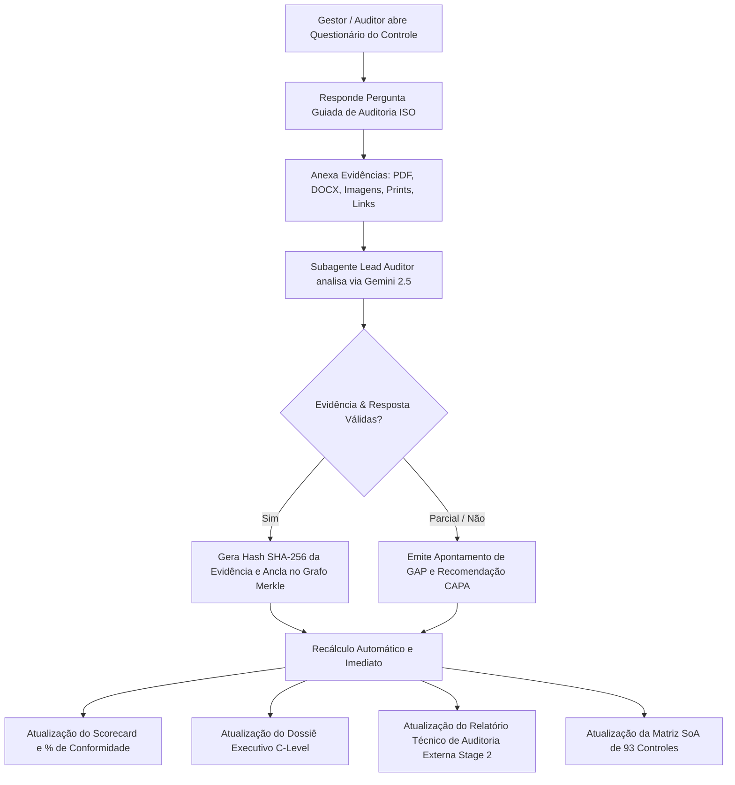

# ROADMAP & EVOLUÇÃO DA PLATAFORMA AGENTIC GRC (GEAP)

Este documento registra o planejamento estratégico, os itens de backlog técnico e a expansão para múltiplos frameworks regulatórios e ambientes multi-cloud do **Agentic GRC** no **Gemini Enterprise Agent Platform (GEAP)**.

---

## 1. Visão Geral Estratégica: De ISO 27001 para Plataforma Multi-Framework e Multi-Cloud

O Agentic GRC nasceu focado na automação completa dos 93 controles da **ISO/IEC 27001:2022** em ambientes Google Cloud. A evolução da plataforma a transformará em um ecossistema unificado capaz de:
1. **Auditar múltiplos frameworks regulatórios** simultaneamente (ISO 27001, SOC 2, PCI-DSS, NIST CSF, LGPD/GDPR).
2. **Conectar e auditar ambientes Multi-Cloud** (Google Cloud, AWS, Microsoft Azure e Oracle Cloud Infrastructure - OCI) via federação de identidade segura (OIDC).
3. **Conduzir questionários interativos de auditoria** com anexação de evidências e recálculo dinâmico e imediato dos relatórios executivos, técnicos e métricas de maturidade.

```
                              +-------------------------------------------------------------------+
                              |       HYBRID & MULTI-CLOUD TELEMETRY INGESTION (CSPM / OIDC)      |
                              +---------------------------------+---------------------------------+
                                                                |
                     +--------------------+---------------------+--------------------+--------------------+
                     |                    |                     |                    |                    |
                     v                    v                     v                    v                    v
            +-----------------+  +-----------------+   +-----------------+  +-----------------+  +-----------------+
            |  Google Cloud   |  |   Amazon Web    |   | Microsoft Azure |  |  Oracle Cloud   |  | Zero-Copy Docs  |
            |  (Asset / SCC)  |  | Services (AWS)  |   |  (Defender/Entra|  |   (OCI Guard)   |  | (Drive/SharePt) |
            +-----------------+  +-----------------+   +-----------------+  +-----------------+  +-----------------+
                     |                    |                     |                    |                    |
                     +--------------------+---------------------+--------------------+--------------------+
                                                                |
                                                                v
                                     +----------------------------------------------------+
                                     |   INTERACTIVE AUDIT INTERVIEWS & QUESTIONNAIRES    |
                                     |   (Human-in-the-Loop Answers + Evidence Uploads)   |
                                     +--------------------------+-------------------------+
                                                                |
                                                                v
                                     +----------------------------------------------------+
                                     |         UNIFIED EVIDENCE GRAPH & TELEMETRY         |
                                     |      (SHA-256 Merkle Anchoring & Cross-Mapping)    |
                                     +--------------------------+-------------------------+
                                                                |
                                                                v
                                     +----------------------------------------------------+
                                     |        ORCHESTRATOR & SUBAGENTS (Gemini 2.5)       |
                                     +--------------------------+-------------------------+
                                                                |
                     +--------------------+---------------------+--------------------+--------------------+
                     |                    |                     |                    |                    |
                     v                    v                     v                    v                    v
            +-----------------+  +-----------------+   +-----------------+  +-----------------+  +-----------------+
            | ISO 27001:2022  |  |  SOC 2 Type II  |   |  PCI-DSS v4.0   |  |  NIST CSF 2.0   |  |   LGPD & GDPR   |
            |  (93 Controles) |  | (Trust Criteria)|   |  (CDE & Cloud)  |  | (SP 800-53 R5)  |  | (DLP & Privacy) |
            +-----------------+  +-----------------+   +-----------------+  +-----------------+  +-----------------+
                     |                    |                     |                    |                    |
                     +--------------------+---------------------+--------------------+--------------------+
                                                                |
                                                                v
                                     +----------------------------------------------------+
                                     |    REAL-TIME EXECUTIVE METRICS & AUDIT REPORTS     |
                                     |    (C-Level Dossier, Stage 2 A4 PDF, JSON, SoA)    |
                                     +----------------------------------------------------+
```

---

## 2. Mecanismos de Seleção: Pré-Deploy e Pré-Acesso

Para garantir flexibilidade operacional, redução no consumo de tokens e adequação a diferentes clientes corporativos, a plataforma suporta a seleção dos frameworks em dois momentos cruciais:

### 2.1. Seleção Pré-Deploy (Deploy-Time Configuration)
Permite que o time de infraestrutura/SRE defina os frameworks ativados antes de compilar ou provisionar o serviço no Cloud Run:

1. **Variáveis de Ambiente / Cloud Run**:
   - `ACTIVE_FRAMEWORKS`: Lista delimitada por vírgula dos frameworks carregados na memória do contêiner.
     ```bash
     ACTIVE_FRAMEWORKS=ISO27001,SOC2,PCIDSS,NIST_CSF,LGPD
     ```
   - `DEFAULT_FRAMEWORK`: Framework ativo por padrão ao abrir a aplicação (ex.: `ISO27001` ou `SOC2`).
   - `ENABLE_CROSS_MAPPING`: `true` ativa a pontuação e correlação cruzada automática de evidências entre normas.

2. **Parâmetros no Terraform Bootstrap (`first_steps`)**:
   - Configuração declarativa no arquivo `terraform.tfvars`:
     ```hcl
     enabled_frameworks = [
       "iso_27001_2022",
       "soc_2_type_2",
       "pci_dss_v4",
       "nist_csf_2_0",
       "lgpd_gdpr"
     ]
     ```
   - Provisionamento condicional de permissões IAM e conectores específicos (ex.: módulo específico de cartões para PCI-DSS).

3. **Vantagens do Pré-Deploy**:
   - Imagens de contêiner otimizadas e consumo menor de memória RAM.
   - Bloqueio rígido de frameworks fora do escopo contratual da organização.

---

### 2.2. Seleção Pré-Acesso (Runtime Onboarding & Workspace Switcher)
Permite que o Lead Auditor e os times de segurança escolham dinamicamente quais frameworks auditar durante o uso da plataforma:

1. **Tela de Boas-Vindas / Onboarding Wizard**:
   - Ao acessar o portal pela primeira vez ou iniciar uma nova auditoria (`Nova Auditoria`), o usuário é recebido por uma tela modal com a seleção de frameworks:
     - Checkbox interativo com cards visuais de cada certificação (ISO 27001, SOC 2, PCI-DSS, NIST, LGPD).
     - Exibição da quantidade de controles associados e dos subagentes especializados necessários.
     - Estimativa prévia de custo de tokens FinOps com base na seleção.

2. **Seletor Global de Frameworks no Topo da Interface (Workspace Switcher)**:
   - Um menu suspenso (*dropdown*) na barra superior ao lado do Escopo de Projetos:
     - Permite alternar a visão ativa (ex.: visualizar apenas a Matriz SOC 2 ou a Matriz ISO 27001).
     - Modo **"Visão Consolidada Multi-Framework"**: Mostra a conformidade global da Organização cruzando todas as normas selecionadas.

3. **Grafo de Evidências com Mapeamento Cruzado (*Cross-Mapping Engine*)**:
   - **Princípio "Collect Once, Comply Many"**:
     - Uma única evidência de telemetria em nuvem (ex.: rotação de chaves KMS de 90 dias) satisfaz:
       - **ISO 27001**: A.8.24 (Uso de Criptografia).
       - **SOC 2**: CC6.1 (Controles Lógicos e Criptografia em Repouso).
       - **PCI-DSS v4.0**: Requisito 3.5.1 (Gestão e Proteção de Chaves Criptográficas).
       - **NIST CSF 2.0**: PR.DS-01 (Dados Protegidos em Repouso).
     - Isso elimina o reprocessamento redundante de tokens Gemini (economia de até 80% via Context Caching).

---

## 3. Catálogo de Novos Frameworks no Roadmap

### 📋 SOC 2 Type II (AICPA Trust Services Criteria)
- **Foco**: Relatório de atestação para clientes B2B sobre a segurança dos serviços em nuvem.
- **Categorias Alvo**:
  - **Security (Common Criteria - CC1 a CC9)**: Controle de acesso IAM, monitoramento contínuo, resposta a incidentes.
  - **Availability (A1)**: Resiliência, backups, SLA em nuvem, Disaster Recovery.
  - **Confidentiality (C1)**: Proteção de dados confidenciais, DLP, KMS.
  - **Processing Integrity (PI1)**: Integridade e validação de pipelines de dados (Dataflow, BigQuery).
  - **Privacy (P1 a P8)**: Gestão de consentimento e retenção.
- **Subagente Especialista**: `SOC2SubAgent` (Auditor de Common Criteria e Geração de Pacote de Evidências para Auditores Externos Big 4).

### 💳 PCI-DSS v4.0 (Payment Card Industry Data Security Standard)
- **Foco**: Proteção de Dados de Titulares de Cartão (CHD) e Dados Sensíveis de Autenticação (SAD).
- **Controles Chave**:
  - **Requisito 1**: Firewall e Cloud Armor / VPC Service Controls ao redor do CDE (*Cardholder Data Environment*).
  - **Requisito 3**: Proteção de dados de cartões via criptografia forte (Cloud KMS / HSM).
  - **Requisito 7 & 8**: Acesso restrito por menor privilégio, MFA obrigatório e Workload Identity.
  - **Requisito 10**: Logs de auditoria imutáveis com retenção mínima de 1 ano.
- **Subagente Especialista**: `PCIDSSSubAgent` (Varredura de perímetros de rede CDE e tokenização de cartões).

### 🏛️ NIST CSF 2.0 & NIST SP 800-53 Rev. 5
- **Foco**: Estrutura governamental e corporativa de cibersegurança dos EUA, amplamente adotada por grandes empresas.
- **Funções CSF 2.0**:
  - **Govern (GV)**: Políticas, estratégia e gestão de riscos da organização.
  - **Identify (ID)**: Gestão de inventário de ativos (Cloud Asset Inventory / CSPM).
  - **Protect (PR)**: IAM, proteção de dados, conscientização.
  - **Detect (DE)**: Detecção de anomalias e telemetria contínua.
  - **Respond (RS)** & **Recover (RC)**: Resposta a incidentes e resiliência operacional.
- **Subagente Especialista**: `NISTSubAgent` (Mapeamento de maturidade e relatórios no formato SP 800-53).

### ⚖️ LGPD (Brasil) & GDPR (Europa)
- **Foco**: Governança de privacidade, conformidade com a ANPD/EDPB e direitos dos titulares.
- **Capacidades**:
  - Inventário e classificação automática de dados pessoais (PII) via Cloud DLP.
  - Registro das Operações de Tratamento (ROPA - Relatório de Impacto à Proteção de Dados).
  - Auditoria de medidas técnicas de segurança (Art. 46 da LGPD) e notificação de incidentes (Art. 48).
- **Subagente Especialista**: `PrivacyAuditorSubAgent` (Conformidade com ANPD, relatórios RIPD e auditoria de políticas de privacidade).

### 🎯 CIS Cloud Foundation Benchmarks (GCP, AWS, Azure)
- **Foco**: Hardening técnico direto dos recursos e configurações de infraestrutura em nuvem.
- **Seções**: IAM, Logging & Monitoring, Networking & Perimeters, Compute, Storage e Databases.
- **Subagente Especialista**: `CISBenchmarkSubAgent` (Verificação automatizada contra checklists oficiais do CIS).

---

## 4. Questionários Interativos de Auditoria ISO com Anexação de Evidências

### 🎯 O Desafio
Na auditoria formal da ISO/IEC 27001:2022, dezenas de controles dependem de **políticas organizacionais, entrevistas de governança e procedimentos humanos** (Cláusulas 4 a 10 e controles organizacionais A.5 e de pessoas A.6) que não podem ser extraídos exclusivamente via telemetria técnica de infraestrutura.

### 💡 A Solução no Roadmap: Motor Interativo de Entrevistas & Anexação de Evidências
Um módulo completo integrado ao portal web que permite aos gestores responderem às perguntas formais de auditoria, anexarem evidências comprobatórias e terem suas respostas avaliadas instantaneamente pela IA, com impacto imediato em todos os relatórios e métricas.



### Principais Capacidades do Módulo:
1. **Catálogo de Perguntas Normativas de Auditoria**:
   - Cada um dos 93 controles da ISO 27001 (e Cláusulas 4 a 10) possui um roteiro estruturado de inquirição com perguntas objetivas e critérios de aceitação formal (ex.: *A.5.1 - Políticas de Segurança da Informação: "A política foi aprovada pela alta direção e comunicada a todos os colaboradores no último ano?"*).
2. **Anexação e Upload Direto de Evidências**:
   - Suporte para arrastar e soltar (*drag-and-drop*) arquivos comprovatórios: Políticas aprovadas (PDF), atas de comitê de segurança, prints de sistemas de RH, certificados de conscientização, relatórios de pentest.
   - Cálculo automático de **Hash SHA-256 imutável** no momento do upload para garantir integridade probatória perante auditores externos (BSI, DNV, TÜV, Big 4).
3. **Avaliação Crítica por IA (Gemini 2.5 Virtual Lead Auditor)**:
   - O subagente examina a coerência da resposta escrita e o conteúdo real do documento anexado (via OCR multimodal e extração de texto Zero-Copy).
   - Classifica o status do controle: `CONFORME`, `CONFORME COM OBSERVAÇÃO`, `NÃO CONFORMIDADE MENOR` ou `NÃO CONFORMIDADE MAIOR`.
4. **Alimentação e Recálculo Dinâmico de Relatórios e Métricas**:
   - **Scorecard Global**: A taxa de conformidade percentual e os radares por domínio (A.5, A.6, A.7, A.8) são atualizados em tempo real.
   - **Dossiê Executivo**: O sumário executivo do C-Level reflete imediatamente a nova evidência validada.
   - **Relatório Técnico Stage 2 (A4 PDF / JSON / Markdown)**: A resposta textual, o nome do responsável, a data, o link do documento e o hash SHA-256 são inseridos automaticamente no capítulo de evidências do relatório oficial para o organismo certificador.

---

## 5. Conectores e Telemetria Multi-Cloud (AWS, Azure, OCI)

### 🎯 O Desafio
Grandes empresas operam em ambientes híbridos e multi-cloud. Uma postura de segurança fragmentada obriga o time de GRC a coletar evidências em múltiplos painéis desconexos, encarecendo a auditoria e gerando pontos cegos.

### 💡 A Solução no Roadmap: Motor CSPM Multi-Cloud Agnóstico
Expansão dos agentes e do Grafo de Evidências para ingerir inventário, configurações e telemetria de segurança da **Amazon Web Services (AWS)**, **Microsoft Azure** e **Oracle Cloud Infrastructure (OCI)** de forma nativa e sem credenciais estáticas.

```
                  +----------------------------------------------------------------+
                  |               AGENTIC GRC MULTI-CLOUD COLLECTOR                |
                  +-------------------------------+--------------------------------+
                                                  |
                 +--------------------------------+--------------------------------+
                 |                                |                                |
                 v                                v                                v
     +-----------------------+        +-----------------------+        +-----------------------+
     |   AWS CLOUD ADAPTER   |        |  AZURE CLOUD ADAPTER  |        |   OCI CLOUD ADAPTER   |
     +-----------------------+        +-----------------------+        +-----------------------+
     | • AWS Security Hub    |        | • Defender for Cloud  |        | • OCI Cloud Guard     |
     | • AWS Config          |        | • Azure Policy Engine |        | • OCI Security Zones  |
     | • IAM Access Analyzer |        | • Entra ID (Azure AD) |        | • OCI Vault (KMS)     |
     | • CloudTrail & KMS    |        | • Key Vault & Storage |        | • Object Storage      |
     | • S3 Bucket Policies  |        | • NSGs & Virtual Nets |        | • VCN & Security Lists|
     +-----------------------+        +-----------------------+        +-----------------------+
                 |                                |                                |
                 +--------------------------------+--------------------------------+
                                                  |
                                                  v
                  +----------------------------------------------------------------+
                  |             NORMALIZED CONTROL MAPPING ABSTRACTION             |
                  |  (Ex: CloudKMS <-> AWS KMS <-> Azure Key Vault <-> OCI Vault)  |
                  +-------------------------------+--------------------------------+
                                                  |
                                                  v
                  +----------------------------------------------------------------+
                  |         CENTRAL EVIDENCE GRAPH & ISO 27001 AUDIT ENGINE        |
                  +----------------------------------------------------------------+
```

### Arquitetura de Conexão Segura (Zero-Key / Workload Identity):
1. **Federação de Identidade OIDC (Sem chaves de longa duração)**:
   - O serviço Cloud Run utiliza Google Workload Identity Federation para assumir **AWS IAM Roles**, **Azure Managed Identities / App Registrations** e **OCI IAM Federation**, eliminando totalmente o armazenamento de segredos estáticos (Access Keys/Secret Keys).
2. **Abstração Unificada de Controles de Nuvem**:
   - Modelos de dados normalizados mapeiam recursos heterogêneos para a taxonomia da ISO 27001:
     - **Controle A.8.24 (Criptografia)**: Audita rotação de chaves no Google Cloud KMS, AWS KMS, Azure Key Vault e OCI Vault.
     - **Controle A.8.20 (Segurança de Redes)**: Audita regras de ingress/egress em Google Cloud VPC Firewalls, AWS Security Groups, Azure NSGs e OCI Security Lists.
     - **Controle A.8.12 (Prevenção de Vazamento de Dados)**: Audita configurações de acesso público em Google Cloud Storage, AWS S3 Buckets, Azure Blob Storage e OCI Object Storage.
     - **Controle A.8.16 (Monitoramento e Logs)**: Audita trilhas de auditoria no Google Cloud Logging, AWS CloudTrail, Azure Activity Logs e OCI Audit Service.
3. **Visão Holística Multi-Cloud no Portal**:
   - Filtro no topo do portal permitindo visualizar a conformidade por nuvem individual (`GCP`, `AWS`, `Azure`, `OCI`) ou a **Postura Consolidada do Grupo Empresarial**.

---

## 6. Cronograma de Lançamento e Versões

| Versão | Escopo Principal | Destaques Técnicos | Previsão |
| :--- | :--- | :--- | :--- |
| **v1.0.0** (Live) | **ISO/IEC 27001:2022 Completa (GCP)** | Servidor MCP, 93 controles, 4 fases autônomas, Grafo de Evidências SHA-256, FinOps, Model Armor, Dossiê C-Level e Relatório Técnico Stage 2 (A4 PDF/JSON/MD). | Concluído ✅ |
| **v1.1.0** (Próxima) | **Remediação de Código (CodeMender)** | Subagente de correção automática de código em sandbox (A.8.28), PRs automatizados com gate HITL, integrações GitHub/GitLab. | Sprint Atual 🚀 |
| **v1.2.0** | **Questionários Interativos ISO & Upload de Evidências** | Roteiro estruturado de perguntas para os 93 controles, anexação drag-and-drop de arquivos, validação por IA e recálculo dinâmico em tempo real de relatórios e métricas. | Q4 2026 |
| **v1.3.0** | **Conectores Multi-Cloud (AWS & Azure)** | Ingestão CSPM multi-nuvem via Workload Identity OIDC, abstração de recursos (KMS, S3, IAM, NSG), filtro multi-cloud no portal. | Q1 2027 |
| **v1.4.0** | **Conector OCI & Frameworks SOC 2 / PCI-DSS v4** | Conector nativo Oracle Cloud (OCI Cloud Guard/Vault), Onboarding Wizard de certificações, catálogo SOC 2 Type II e PCI-DSS v4.0. | Q2 2027 |
| **v2.0.0** | **Plataforma Global GRC 360° (NIST & LGPD/GDPR)** | NIST CSF 2.0, LGPD/GDPR com Cloud DLP, motor de Cross-Mapping universal (*Collect Once, Comply Many*) e auditoria contínua multi-cloud autônoma. | H2 2027 |

---

## 7. Backlog Técnico Prioritário

### 🛡️ 1. Correção de Vulnerabilidade no Código (CodeMender)
- **Controles Alvo**: ISO/IEC 27001:2022 **A.8.28 (Desenvolvimento Seguro)** e **A.8.25 (Ciclo de Vida de Desenvolvimento Seguro)**.
- **Missão**: Delegar varreduras profundas de SAST/DAST e secrets em repositórios Git, executando correções simuladas em contêineres sandbox isolados e abrindo Pull Requests com aprovação humana obrigatória (*Human-in-the-Loop*).

### 📝 2. Motor de Questionários e Evidências Human-in-the-Loop
- **Controles Alvo**: Cláusulas 4 a 10 e Domínios A.5 (Organizacional) e A.6 (Pessoas).
- **Missão**: Permitir que equipes de conformidade e gestores de processos respondam formalmente aos requisitos normativos, anexem arquivos comprobatórios com hash SHA-256 e visualizem o impacto instantâneo nos relatórios oficiais e no scorecard de certificação.

### 🌐 3. Adaptadores Multi-Cloud de Coleta Contínua (CSPM)
- **Controles Alvo**: A.5.23 (Segurança em Serviços Cloud), A.8.12 (DLP), A.8.20 (Redes), A.8.24 (Criptografia).
- **Missão**: Estender os subagentes de telemetria para consultar APIs da AWS (boto3), Azure (azure-mgmt) e OCI via federação segura OIDC, unificando a governança de infraestrutura de TI em uma única interface inteligente.
