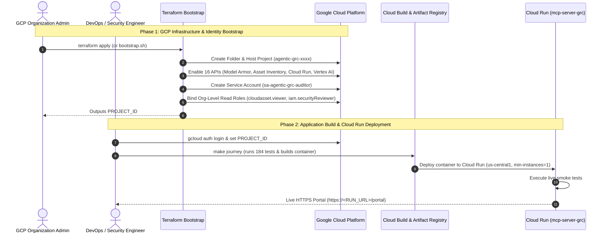
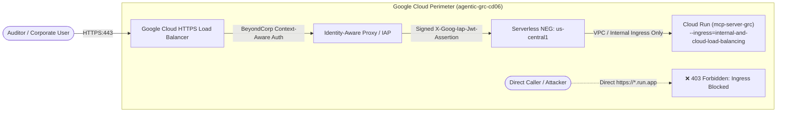

# Infrastructure & Environment Setup Guide
## Complete Deployment & Provisioning Manual for Google Cloud Security & Agentic GRC

> **Document Version**: 1.0.0  
> **Status**: Production Ready  
> **Target Audience**: DevOps Engineers, Cloud Platform Admins, Security Engineers  
> **Platform**: Google Cloud Platform (GCP) • Cloud Run • Terraform • Docker  
> **Repository**: `https://github.com/g-jsaccomani/agentic_grc_certifications.git`  
> **Language**: English

---

## 1. Overview & Architecture Workflow

The deployment of the Agentic Compliance Readiness Accelerator follows a strict **Two-Phase Architecture**:

1. **Phase 1: Infrastructure & Security Identity Bootstrap (Terraform)**:
   - Provisions a dedicated folder (`fldr-agentic-grc`) and host project in your GCP Organization.
   - Enables all 16 required Google Cloud APIs.
   - Configures the auditor service account (`sa-agentic-grc-auditor`) with read-only organization-level IAM permissions.
2. **Phase 2: Container Packaging & Cloud Run Deployment (`make journey`)**:
   - Executes the automated 184-test validation suite.
   - Builds the production container image via Google Cloud Build.
   - Deploys the service to Google Cloud Run with managed HTTPS, zero-trust headers, and autoscaling.



---

## 2. Security Posture & Identity Separation: Build vs. Runtime Inspection

To satisfy strict enterprise security compliance and client zero-trust governance, the Agentic GRC platform enforces a rigorous architectural separation between **Build-Time Packaging Identities** and **Runtime Inspection Identities**:

### 2.1 Build-Time Identity Boundary
- **Identity**: Google Cloud Default Compute / Cloud Build Service Account (`<PROJECT_NUMBER>-compute@developer.gserviceaccount.com`).
- **Assigned Roles**: `roles/storage.admin`, `roles/artifactregistry.writer`, `roles/logging.logWriter`.
- **Scope & Lifecycle**: Used **ONLY** during container compilation, packaging, and Cloud Run deployment (`scripts/deploy.sh` or `make journey`).
- **Operational Boundary**: This identity is **NEVER** used during live audit execution, compliance scanning, or client environment telemetry gathering.

### 2.2 Runtime Inspection Path (`mcp_server_grc/cloud_inspector.py`)
- **Identity & Delegation**: The runtime inspection path (`mcp_server_grc/cloud_inspector.py`) uses only the logged-in user's own delegated OAuth token and makes zero write API calls against client resources.
- **Assigned Roles**: Read-only organization viewer roles (`roles/cloudasset.viewer`, `roles/browser`, `roles/iam.securityReviewer`, `roles/securitycenter.findingsViewer`).
- **Zero Mutation Guarantee**: Makes **zero write API calls** against client resources. Every live check is strictly a read-only `GET` or read-only `getIamPolicy` `POST`.
- **Explicit Leadership Mandate**:
  > [!IMPORTANT]
  > **No service account used during live environment inspection has write permissions on client resources.**

### 2.3 Identity Separation Matrix

| Property | Build-Time Service Account | Runtime Cloud Inspector (`cloud_inspector.py`) |
| :--- | :--- | :--- |
| **Service Account** | `<PROJECT_NUMBER>-compute@developer.gserviceaccount.com` | Logged-in User Delegated OAuth Token / `sa-agentic-grc-auditor` |
| **Permissions** | `storage.admin`, `artifactregistry.writer`, `logging.logWriter` | `cloudasset.viewer`, `iam.securityReviewer`, `browser` |
| **Usage Phase** | Container build & Cloud Run deployment | Live audit scanning, natural language query, evidence verification |
| **Write Access** | Restricted to container registry & build logs | **ZERO write permissions on client infrastructure** |
| **Call Safety** | One-time execution during deployment pipeline | Read-only discovery with session rate limiting & call budget |

---

## 3. Tooling & System Prerequisites

Ensure your deployment workstation has the following tools installed and authenticated:

| Tool | Minimum Version | Verification Command | Description |
| :--- | :--- | :--- | :--- |
| **Git** | 2.30+ | `git --version` | Source code management. |
| **Python** | 3.11 or 3.12 | `python3 --version` | Runtime for MCP server and automated tests. |
| **Google Cloud SDK** | 460.0.0+ | `gcloud --version` | Authenticated with GCP Organization or Project privileges. |
| **Terraform** | >= 1.5.0 | `terraform -version` | Infrastructure as Code provisioning. |
| **uv** (Optional) | Latest | `uv --version` | Ultra-fast Python package manager (Makefile auto-detects). |
| **Docker** (Optional)| 24.0+ | `docker --version` | Local container execution (Cloud Build is default). |

---

## 4. Phase 1: GCP Infrastructure & Security Identity Bootstrap

### 3.1 Automated Cloud Shell Flow (Fastest)
Run this single command inside [Google Cloud Shell](https://shell.cloud.google.com):
```bash
curl -sSL https://raw.githubusercontent.com/g-jsaccomani/agentic_grc_certifications/main/terraform/first_steps/bootstrap.sh | bash
```
When execution completes, note the generated `PROJECT_ID`:
```text
======================================================================
PROJECT_ID: agentic-grc-cd06
======================================================================
```

### 3.2 Manual Terraform Bootstrap Execution
If running from your local workstation:
```bash
cd terraform/first_steps
cp terraform.tfvars.example terraform.tfvars
```

Edit `terraform.tfvars` with your organization and billing details:
```hcl
organization_id    = "123456789012"
billing_account_id = "012345-6789AB-CDEF01"
region             = "us-central1"
project_prefix     = "agentic-grc"
```

Initialize and apply:
```bash
terraform init
terraform apply -auto-approve
```

### 3.3 What is Automatically Created
1. **Dedicated GCP Folder**: `fldr-agentic-grc` isolating compliance operations.
2. **Dedicated GCP Project**: `agentic-grc-<id>` attached to your designated billing account.
3. **16 Required APIs**:
   - `modelarmor.googleapis.com` (Prompt-injection & safety defense)
   - `run.googleapis.com` (Cloud Run serverless hosting)
   - `cloudasset.googleapis.com` (Cloud Asset Inventory real-time query)
   - `securitycenter.googleapis.com` (Security Command Center findings)
   - `accesscontextmanager.googleapis.com` (VPC-SC perimeter audit)
   - `cloudkms.googleapis.com` (KMS key inspection & rotation)
   - `bigquery.googleapis.com` (Audit logging analytics)
   - `aiplatform.googleapis.com` (Vertex AI platform & Gemini 2.5)
   - `discoveryengine.googleapis.com` (Gemini Enterprise integration)
   - `artifactregistry.googleapis.com` (Container images)
   - `cloudbuild.googleapis.com` (Container build pipeline)
   - `iam.googleapis.com`, `cloudresourcemanager.googleapis.com`, `serviceusage.googleapis.com`, `logging.googleapis.com`, `monitoring.googleapis.com`
4. **Service Account**: `sa-agentic-grc-auditor@<PROJECT_ID>.iam.gserviceaccount.com`.
5. **Organization-Level Read-Only IAM Bindings**:
   - `roles/cloudasset.viewer`: Query any asset state across all projects.
   - `roles/browser`: Read organization and folder hierarchy.
   - `roles/iam.securityReviewer`: Audit IAM bindings without write access.
   - `roles/securitycenter.findingsViewer`: Read SCC security findings.
   - `roles/accesscontextmanager.policyReader`: Read VPC Service Controls perimeters.

---

## 5. Google Workspace OAuth 2.0 Client Setup

The portal integrates with Google Workspace Single Sign-On. To configure authentication:

1. In the Google Cloud Console, navigate to **APIs & Services** > **Credentials**.
2. Click **Create Credentials** > **OAuth Client ID**.
3. Select Application type: **Web application**.
4. Set **Name**: `Agentic GRC Portal`.
5. Under **Authorized JavaScript Origins**, add:
   - `http://localhost:8080` (Local testing)
   - `https://<YOUR_SERVICE_NAME>-<HASH>.a.run.app` (Cloud Run production URL)
6. Under **Authorized Redirect URIs**, add:
   - `http://localhost:8080/portal`
   - `https://<YOUR_SERVICE_NAME>-<HASH>.a.run.app/portal`
7. Click **Create**. Copy the generated `Client ID`.
8. Configure the client ID directly in the portal code:
   Edit the `GOOGLE_WORKSPACE_CONFIG.clientId` (and optionally `expectedDomain`) value directly in `mcp_server_grc/portal_html.py` (around line 9723) and redeploy:
   ```javascript
   const GOOGLE_WORKSPACE_CONFIG = {
       clientId: "<YOUR_CLIENT_ID>.apps.googleusercontent.com",
       expectedDomain: "client.corp",
       ...
   };
   ```
   After updating, redeploy using `bash scripts/deploy.sh` or `make journey`.

---

## 6. Granting Consultant/Partner Access for Final Configuration

When engaging external security consultants or technical partners to assist with deployment, verification, and final configuration, adhere strictly to the principle of least privilege using time-boxed, temporary IAM conditions.

### 5.1 Required Scoped Roles
Grant access only to the host project (`PROJECT_ID`) where the Cloud Run service and deployment artifacts reside. The consultant requires:
- `roles/run.admin`: Manage, deploy, and inspect Cloud Run services.
- `roles/iam.serviceAccountUser`: Impersonate the Cloud Run runtime service account during deployment.
- `roles/resourcemanager.projectIamAdmin` (or narrower `roles/iam.securityAdmin`): Configure service-to-service IAM bindings.
- `roles/serviceusage.serviceUsageAdmin`: Enable required GCP APIs if additional services are introduced.

### 5.2 Time-Boxed IAM Binding Grant Command
The client organization admin executes the following command, specifying an explicit expiry timestamp (e.g., 7 days from setup):

```bash
PROJECT_ID="<YOUR_HOST_PROJECT_ID>"
CONSULTANT_USER="user:consultant@partner.corp"
EXPIRY_TIMESTAMP="$(date -u -v+7d "+%Y-%m-%dT%H:%M:%SZ" 2>/dev/null || date -u -d "+7 days" "+%Y-%m-%dT%H:%M:%SZ")"

for ROLE in \
  "roles/run.admin" \
  "roles/iam.serviceAccountUser" \
  "roles/resourcemanager.projectIamAdmin" \
  "roles/serviceusage.serviceUsageAdmin"; do
  gcloud projects add-iam-policy-binding "${PROJECT_ID}" \
    --member="${CONSULTANT_USER}" \
    --role="${ROLE}" \
    --condition="expression=request.time < timestamp('${EXPIRY_TIMESTAMP}'),title=temporary_consultant_access,description=Expires at ${EXPIRY_TIMESTAMP}" \
    --quiet
done
```

### 5.3 Immediate Revocation Command (Post-Configuration)
Once deployment and handover are verified, the client revokes all temporary bindings immediately:

```bash
PROJECT_ID="<YOUR_HOST_PROJECT_ID>"
CONSULTANT_USER="user:consultant@partner.corp"

for ROLE in \
  "roles/run.admin" \
  "roles/iam.serviceAccountUser" \
  "roles/resourcemanager.projectIamAdmin" \
  "roles/serviceusage.serviceUsageAdmin"; do
  gcloud projects remove-iam-policy-binding "${PROJECT_ID}" \
    --member="${CONSULTANT_USER}" \
    --role="${ROLE}" \
    --all \
    --quiet
done
```

---

## 7. Phase 2: Application Build & Cloud Run Deployment

Deploy the platform container to Cloud Run using the automated build script:

### Step 6.1: Authenticate gcloud
```bash
gcloud auth login
gcloud auth application-default login
```

### Step 6.2: Set Environment Variables
```bash
export PROJECT_ID="<YOUR_PROJECT_ID_FROM_PHASE_1>"
export REGION="us-central1"
export SERVICE_NAME="mcp-server-grc"
```

### Step 6.3: Run Automated Deployment Journey
```bash
make journey
```

#### What `make journey` Executes:
1. Runs the complete test suite (184 unit, integration, and guardrail tests).
2. Submits the code to Google Cloud Build.
3. Builds and pushes the Docker container to Artifact Registry.
4. Deploys to Cloud Run with:
   - `--min-instances=1` (Prevents cold starts during demos).
   - `--memory=2Gi` and `--cpu=2`.
   - `--allow-unauthenticated` (Zero-trust identity handled at application layer).
5. Runs automated HTTP smoke tests against `/portal` and `/api/audit/summary`.
6. Prints the public live HTTPS URL.

---

## 7. Enterprise Defense-in-Depth: Cloud Run Ingress Lockdown & BeyondCorp IAP Setup

To guarantee zero-trust enterprise security and prevent authentication bypass, the Cloud Run service must be isolated so that **no traffic can reach it directly via its public `*.run.app` URL**. All requests must flow through an external Application Load Balancer with **Google Cloud Identity-Aware Proxy (IAP) / BeyondCorp** enabled.



### 7.1 Provisioning the IAP-Enabled HTTPS Load Balancer

Execute the following `gcloud` commands to configure the load balancer and enable IAP in front of `mcp-server-grc`:

#### Step 1: Set Variables
```bash
export PROJECT_ID="agentic-grc-cd06"
export REGION="us-central1"
export SERVICE_NAME="mcp-server-grc"
export DOMAIN_NAME="grc.yourdomain.corp" # Your custom domain
export PROJECT_NUMBER=$(gcloud projects describe ${PROJECT_ID} --format="value(projectNumber)")
```

#### Step 2: Reserve Global Static IP
```bash
gcloud compute addresses create grc-lb-ip \
    --global \
    --project=${PROJECT_ID}
```

#### Step 3: Create Serverless Network Endpoint Group (NEG)
```bash
gcloud compute network-endpoint-groups create grc-cloud-run-neg \
    --region=${REGION} \
    --network-endpoint-type=SERVERLESS \
    --cloud-run-service=${SERVICE_NAME} \
    --project=${PROJECT_ID}
```

#### Step 4: Create Backend Service
```bash
gcloud compute backend-services create grc-backend-service \
    --global \
    --load-balancing-scheme=EXTERNAL_MANAGED \
    --protocol=HTTPS \
    --project=${PROJECT_ID}

gcloud compute backend-services add-backend grc-backend-service \
    --global \
    --network-endpoint-group=grc-cloud-run-neg \
    --network-endpoint-group-region=${REGION} \
    --project=${PROJECT_ID}
```

#### Step 5: Enable IAP on the Backend Service
> [!IMPORTANT]
> Obtain the OAuth 2.0 Web Client credentials configured for IAP from **GCP Console > Security > Identity-Aware Proxy**.
```bash
export IAP_CLIENT_ID="<YOUR_IAP_OAUTH_CLIENT_ID>"
export IAP_CLIENT_SECRET="<YOUR_IAP_OAUTH_CLIENT_SECRET>"

gcloud compute backend-services update grc-backend-service \
    --global \
    --iap=enabled,oauth2-client-id=${IAP_CLIENT_ID},oauth2-client-secret=${IAP_CLIENT_SECRET} \
    --project=${PROJECT_ID}
```

#### Step 6: Determine the Exact Expected IAP Audience
The IAP audience is cryptographically signed into every `X-Goog-Iap-Jwt-Assertion` token. Obtain the exact backend service ID:
```bash
export BACKEND_SERVICE_ID=$(gcloud compute backend-services describe grc-backend-service \
    --global \
    --format="value(id)" \
    --project=${PROJECT_ID})

# Exact IAP Audience string:
export EXPECTED_IAP_AUDIENCE="/projects/${PROJECT_NUMBER}/global/backendServices/${BACKEND_SERVICE_ID}"
echo "Calculated Expected IAP Audience: ${EXPECTED_IAP_AUDIENCE}"
```

#### Step 7: Create URL Map, SSL Certificate, Target HTTPS Proxy & Forwarding Rule
```bash
# URL Map
gcloud compute url-maps create grc-url-map \
    --default-service=grc-backend-service \
    --project=${PROJECT_ID}

# Google-managed SSL Certificate
gcloud compute ssl-certificates create grc-ssl-cert \
    --domains=${DOMAIN_NAME} \
    --project=${PROJECT_ID}

# Target HTTPS Proxy
gcloud compute target-https-proxies create grc-https-proxy \
    --ssl-certificates=grc-ssl-cert \
    --url-map=grc-url-map \
    --project=${PROJECT_ID}

# Global Forwarding Rule (Port 443)
gcloud compute forwarding-rules create grc-https-forwarding-rule \
    --load-balancing-scheme=EXTERNAL_MANAGED \
    --network-tier=PREMIUM \
    --address=grc-lb-ip \
    --global \
    --target-https-proxy=grc-https-proxy \
    --ports=443 \
    --project=${PROJECT_ID}
```

---

### 7.2 Cloud Run Ingress Lockdown (Defense-in-Depth)

Once the HTTPS Load Balancer and IAP are configured, enforce strict Cloud Run ingress lockdown:

```bash
# 1. Lock down ingress so Cloud Run rejects direct public traffic
gcloud run services update ${SERVICE_NAME} \
    --ingress=internal-and-cloud-load-balancing \
    --region=${REGION} \
    --project=${PROJECT_ID}

# 2. Inject the verified IAP Audience into Cloud Run environment
gcloud run services update ${SERVICE_NAME} \
    --set-env-vars="GOOGLE_IAP_AUDIENCE=${EXPECTED_IAP_AUDIENCE}" \
    --region=${REGION} \
    --project=${PROJECT_ID}
```

#### Verification of Ingress Lockdown:
1. **Direct Request (`https://<service>-<hash>-uc.a.run.app/portal`)**:
   Returns `403 Forbidden` (rejected at Google Front End edge because ingress is restricted to load balancing).
2. **Load Balancer Request (`https://grc.yourdomain.corp/portal`)**:
   Routes through Google Cloud IAP. Validates BeyondCorp device posture and corporate identity, attaches signed `X-Goog-Iap-Jwt-Assertion`, and the backend cryptographically verifies the token against Google's public JWK set (`https://www.gstatic.com/iap/verify/public_key-jwk`).

---

## 8. Functional Lab Projects Setup (POC Target Scope)

For POC demonstrations, the system audits multi-project environments. You can connect existing corporate non-prod projects or provision the functional lab projects:

| Project ID | Role in POC | Assets Audited |
| :--- | :--- | :--- |
| `fnlab-apps-8fa913` | Application Workloads | GCS Buckets, Non-compliant SSH Firewall, Software KMS Keys |
| `fnlab-ai-data-8fa913` | AI & Analytics Data | GCS Analytics Buckets, Over-privileged IAM Owner roles |
| `fnlab-sec-mgmt-8fa913`| Security & Management | Compliant HSM KMS Keys, Internal Management Firewalls |
| `aispr-core-1cab11` | Core Infrastructure | Log storage buckets, Open RDP Firewall Rules |

To verify that the service account can inspect all target projects:
```bash
python scripts/verify_poc_environment.py
```

---

## 9. Local Development & Testing Workflow

To run and modify the platform locally:

### 8.1 Install Virtual Environment
```bash
make install
```
*(Creates `.venv` using `uv` or `python -m venv` and installs all dependencies).*

### 8.2 Run Test Suite
```bash
make test
```
*(Executes all 184 tests with coverage output).*

### 8.3 Launch Local Web Portal
```bash
make run-portal
```
Open your browser and navigate to:
```text
http://localhost:8080/portal
```

### 8.4 Launch Standalone MCP Server
To expose the Model Context Protocol (MCP) server on port 8080 for Gemini Enterprise Agent Studio:
```bash
make run-mcp
```

---

## 10. Maintenance & Operational Commands

| Command | Purpose |
| :--- | :--- |
| `make clean` | Clean temporary `.pytest_cache`, `__pycache__`, and build artifacts. |
| `make test` | Run full automated test suite. |
| `make run-portal` | Start local portal server on port 8080. |
| `make journey` | Full end-to-end test, container build, and Cloud Run deployment. |
| `python scripts/verify_poc_environment.py` | Verify live telemetry access across target GCP projects. |
| `./scripts/cleanup_poc_resources.sh --dry-run` | Preview cleanup of temporary POC resources. |
