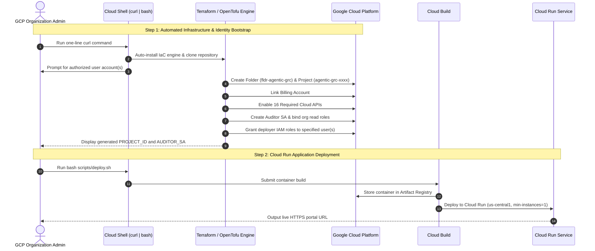

# Product Implementation & Deployment Guide: Agentic GRC Auditor
## Automated Google Cloud Platform (GCP) Provisioning & Setup

> **Target Platform**: Google Cloud Platform (Cloud Shell, Cloud Run, Vertex AI, Cloud Asset Inventory)  
> **Deployment Mode**: 100% Cloud-Native (Zero local dependencies required)  
> **Region**: `us-central1`  
> **Service Name**: `mcp-server-grc`  
> **Language**: English

---

## 1. Overview

This guide provides the complete, step-by-step procedure to provision and deploy the **Agentic GRC Auditor** in Google Cloud Platform. 

The implementation requires no local workstation tools—everything runs directly inside [Google Cloud Shell](https://shell.cloud.google.com).



---

## 2. Step 1: Automated Infrastructure & Identity Bootstrap (One-Line Curl)

Open [Google Cloud Shell](https://shell.cloud.google.com) with an account holding **Organization Administrator** (or Folder Admin + Billing Account User) privileges, and run:

```bash
curl -sSL https://raw.githubusercontent.com/g-jsaccomani/agentic_grc_certifications/main/terraform/first_steps/bootstrap.sh | bash
```

### What This Command Automatically Executes:
1. **Tool Verification**: Checks for a functional Terraform or OpenTofu binary; if missing or stubbed, automatically downloads and installs the official binary into `~/.local/bin`.
2. **Organization & Billing Detection**: Automatically detects your GCP Organization ID and active billing account.
3. **User Access Configuration**: Prompts you to enter the email address(es) of authorized engineers who will manage and operate the platform (e.g., `engineer@company.com` or `group:devops@company.com`).
4. **Folder Creation**: Creates a dedicated GCP folder (`fldr-agentic-grc`) to isolate compliance workloads.
5. **Project Creation**: Provisions a dedicated GCP host project (`agentic-grc-<random-id>`) under the folder and links the billing account.
6. **API Enablement**: Automatically enables all 16 required Google Cloud APIs:
   - `run.googleapis.com` (Cloud Run serverless hosting)
   - `aiplatform.googleapis.com` (Vertex AI & Gemini 2.5)
   - `modelarmor.googleapis.com` (Prompt-injection defense)
   - `cloudasset.googleapis.com` (Real-time Cloud Asset Inventory inspection)
   - `securitycenter.googleapis.com` (Security Command Center findings)
   - `cloudkms.googleapis.com` (KMS key audit & validation)
   - `bigquery.googleapis.com` (Audit logging analytics)
   - `accesscontextmanager.googleapis.com` (VPC-SC perimeter audit)
   - `cloudbuild.googleapis.com` & `artifactregistry.googleapis.com` (Container builds)
   - Core management: `iam.googleapis.com`, `cloudresourcemanager.googleapis.com`, `serviceusage.googleapis.com`, `logging.googleapis.com`, `monitoring.googleapis.com`
7. **Auditor Identity Provisioning**: Creates the auditor service account (`sa-agentic-grc-auditor@<PROJECT_ID>.iam.gserviceaccount.com`) and binds read-only organization-level IAM roles:
   - `roles/cloudasset.viewer`
   - `roles/browser`
   - `roles/iam.securityReviewer`
   - `roles/securitycenter.findingsViewer`
8. **User IAM Grant**: Grants the specified authorized user(s) the necessary deployment and administration roles on the project (`roles/run.admin`, `roles/iam.serviceAccountUser`, `roles/resourcemanager.projectIamAdmin`, `roles/serviceusage.serviceUsageAdmin`).

### Bootstrap Output
When the script finishes, it displays the generated credentials and resource IDs:
```text
================================================================
              FIRST STEPS PROVISIONING COMPLETED!               
================================================================

PROJECT_ID: agentic-grc-cd06
FOLDER_ID:  folders/123456789012
AUDITOR_SA: sa-agentic-grc-auditor@agentic-grc-cd06.iam.gserviceaccount.com
----------------------------------------------------------------
```

---

## 3. Step 2: Deploy the Application to Cloud Run

Inside the same Cloud Shell session, navigate to the cloned bootstrap directory, set your generated `PROJECT_ID`, and execute the automated deployment script:

```bash
cd "${HOME}/.agentic_grc_bootstrap"
export PROJECT_ID="<YOUR_PROJECT_ID_FROM_STEP_1>"
export REGION="us-central1"

bash scripts/deploy.sh
```

### What `scripts/deploy.sh` Executes:
1. Verifies all 16 Google Cloud APIs are active in the project.
2. Initializes the **Model Armor Safety Template** (`g-rc-safety-baseline`) for prompt-injection defense.
3. Submits the application source to **Google Cloud Build** to produce a production container image in Artifact Registry.
4. Deploys the service `mcp-server-grc` to **Google Cloud Run** with enterprise parameters:
   - `--min-instances=1` (Prevents cold starts during operations and demos).
   - `--memory=2Gi` and `--cpu=2`.
   - `--allow-unauthenticated` (Zero-trust identity is enforced at application layer via Google Workspace SSO).
   - Configures runtime environment variables: `GOOGLE_GENAI_USE_VERTEXAI=true`, `GOOGLE_CLOUD_PROJECT`, `GOOGLE_CLOUD_LOCATION`.
5. Outputs the public live HTTPS portal URL:
   ```text
   Live Web Portal: https://mcp-server-grc-<hash>-uc.a.run.app/portal
   ```

---

## 4. Step 3: Configure Google Workspace Single Sign-On (SSO)

To allow team members to log into the web portal with their corporate Google accounts:

1. In the Google Cloud Console, navigate to **APIs & Services** > **Credentials**.
2. Click **Create Credentials** > **OAuth Client ID**.
3. Select Application type: **Web application**.
4. Under **Authorized JavaScript Origins**, add your Cloud Run HTTPS URL:
   ```text
   https://mcp-server-grc-<hash>-uc.a.run.app
   ```
5. Under **Authorized Redirect URIs**, add:
   ```text
   https://mcp-server-grc-<hash>-uc.a.run.app/portal
   ```
6. Click **Create** and copy the generated **Client ID**.
7. In `mcp_server_grc/portal_html.py` (around line 9723), update the `clientId` and `expectedDomain`:
   ```javascript
   const GOOGLE_WORKSPACE_CONFIG = {
       clientId: "<YOUR_CLIENT_ID>.apps.googleusercontent.com",
       expectedDomain: "client.corp",
       ...
   };
   ```
8. Redeploy the service:
   ```bash
   bash scripts/deploy.sh
   ```

---

## 5. Step 4: Granting Temporary Consultant or Partner Access

If external security consultants or implementation partners assist with final configuration, grant temporary, time-boxed access using least-privilege IAM conditions:

### 5.1 Grant Time-Boxed IAM Binding
Run this command in Cloud Shell, setting an explicit expiry timestamp (e.g., 7 days from today):

```bash
PROJECT_ID="<YOUR_PROJECT_ID>"
CONSULTANT_USER="user:consultant@partner.corp"
EXPIRY_TIMESTAMP="$(date -u -v+7d "+%Y-%m-%dT%H:%M:%SZ" 2>/dev/null || date -u -d "+7 days" "+%Y-%m-%dT%H:%M:%SZ")"

for ROLE in \
  "roles/run.admin" \
  "roles/iam.serviceAccountUser" \
  "roles/resourcemanager.projectIamAdmin" \
  "roles/serviceusage.serviceUsageAdmin"; do
  gcloud projects add-iam-policy-binding "${PROJECT_ID}" \
    --member="${CONSULTANT_USER}" \
    --role="${ROLE}" \
    --condition="expression=request.time < timestamp('${EXPIRY_TIMESTAMP}'),title=temporary_consultant_access,description=Expires at ${EXPIRY_TIMESTAMP}" \
    --quiet
done
```

### 5.2 Revoke Access (Post-Implementation)
Once deployment is validated, revoke all temporary bindings immediately:

```bash
PROJECT_ID="<YOUR_PROJECT_ID>"
CONSULTANT_USER="user:consultant@partner.corp"

for ROLE in \
  "roles/run.admin" \
  "roles/iam.serviceAccountUser" \
  "roles/resourcemanager.projectIamAdmin" \
  "roles/serviceusage.serviceUsageAdmin"; do
  gcloud projects remove-iam-policy-binding "${PROJECT_ID}" \
    --member="${CONSULTANT_USER}" \
    --role="${ROLE}" \
    --all \
    --quiet
done
```

---

## 6. Step 5: Post-Deployment Verification

Verify your live deployment by running these commands directly in Cloud Shell:

### 6.1 Check Discovery Endpoint
```bash
curl -s "https://mcp-server-grc-<hash>-uc.a.run.app/.well-known/agent.json" | jq .
```
*Verification*: Returns the registered Agent Card with protocol version and capability definitions.

### 6.2 Check Questionnaire Summary
```bash
curl -s "https://mcp-server-grc-<hash>-uc.a.run.app/api/questionnaire/summary" | jq .
```
*Verification*: Returns 93 ISO/IEC 27001:2022 controls ready for automated audit.

### 6.3 Open the Web Portal
Open your browser and navigate to:
```text
https://mcp-server-grc-<hash>-uc.a.run.app/portal
```
Authenticate with your configured Google Workspace account to begin continuous security auditing.

---

## 7. Cloud Operational Reference

| Operation | Command |
| :--- | :--- |
| **Check Service Status** | `gcloud run services describe mcp-server-grc --project="${PROJECT_ID}" --region="us-central1"` |
| **Keep Service Warm (min-instances=1)** | `gcloud run services update mcp-server-grc --project="${PROJECT_ID}" --region="us-central1" --min-instances=1` |
| **Tail Live Application Logs** | `gcloud run services logs tail mcp-server-grc --project="${PROJECT_ID}" --region="us-central1"` |
| **Re-deploy Container** | `bash scripts/deploy.sh` |
