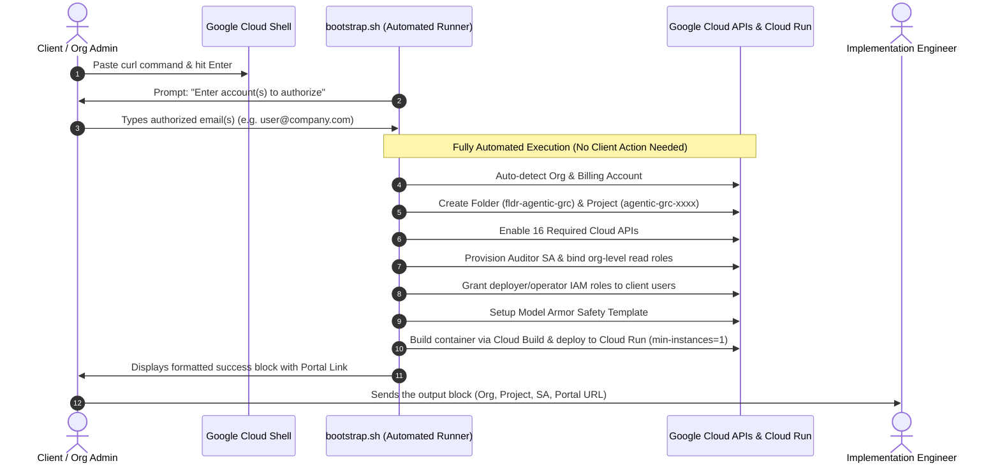

# Product Implementation & Live Customer Demonstration Guide: Agentic GRC Auditor
## Google Cloud Platform (GCP) Deployment, Verification Runbook & Executive FAQ

> **Document Version**: 2.1.0  
> **Target Platform**: Google Cloud Platform (Cloud Shell, Cloud Run, Vertex AI, Cloud Asset Inventory)  
> **Deployment Mode**: 100% Cloud-Native (Zero local workstation setup required)  
> **Target Region**: `us-central1`  
> **Service Name**: `mcp-server-grc`  
> **Security Posture**: Strictly Read-Only Discovery & Telemetry (Zero Mutation Privilege)  
> **Language**: English

---

# Part I: Automated GCP Deployment Guide

## 1. Executive Summary & Zero-Touch Client Experience

The deployment of the **Agentic GRC Auditor** platform is entirely automated and transparent. The client does not need to install local tools, configure virtual environments, or run multi-stage command sequences on their laptop.

### The Single Client Workflow:
1. **Open Google Cloud Shell**.
2. **Paste the single curl command** and press Enter.
3. **Type the email address(es)** of team members who should receive access.
4. **Copy the final output block** (containing Organization, Project, and Portal URL) and send it to the implementation engineer.



---

## 2. Automated One-Click Deployment Command

In [Google Cloud Shell](https://shell.cloud.google.com), execute the single bootstrap command:

```bash
curl -sSL https://raw.githubusercontent.com/g-jsaccomani/agentic_grc_certifications/main/terraform/first_steps/bootstrap.sh | bash
```

### Prompt Interaction (The Only Step for the Client):
During execution, the script will prompt for the authorized user email(s):
```text
[4/6] Configuring Authorized Platform Access...
Please specify the email address(es) of the user(s) or group(s) who will have access.
Supported: engineer@company.com or comma-separated: user1@company.com, user2@company.com

Enter account(s) to authorize [Default: current-user@company.com]: 
```
Type the email(s) and press **Enter** (or simply press Enter to accept your current logged-in Google Cloud account).

---

## 3. What the Automated Script Executes End-to-End

Everything below executes automatically without manual intervention:

1. **Tool Verification**: Checks for a functional Terraform or OpenTofu binary. If missing or running inside a Cloud Shell placeholder, it automatically installs official HashiCorp Terraform into `~/.local/bin`.
2. **Organization & Billing Detection**: Automatically discovers your GCP Organization ID and active billing account.
3. **Dedicated Folder & Project**: Provisions the `fldr-agentic-grc` folder and an isolated host project (`agentic-grc-<id>`) with billing attached.
4. **Enables 16 Google Cloud APIs**:
   - `run.googleapis.com` (Cloud Run serverless runtime)
   - `aiplatform.googleapis.com` (Vertex AI and Gemini 2.5)
   - `modelarmor.googleapis.com` (Prompt-injection defense)
   - `cloudasset.googleapis.com` (Organization-level asset inspection)
   - `securitycenter.googleapis.com` (Security Command Center integration)
   - `cloudkms.googleapis.com` (Cryptographic key validation)
   - `bigquery.googleapis.com` (Audit logging and analytics)
   - `accesscontextmanager.googleapis.com` (VPC-SC perimeter validation)
   - `cloudbuild.googleapis.com` & `artifactregistry.googleapis.com` (Container builds)
   - Management: `iam.googleapis.com`, `cloudresourcemanager.googleapis.com`, `serviceusage.googleapis.com`, `logging.googleapis.com`, `monitoring.googleapis.com`
5. **Auditor Identity Provisioning**: Creates the auditor service account (`sa-agentic-grc-auditor@<PROJECT_ID>.iam.gserviceaccount.com`) and binds read-only organization-level roles (`roles/cloudasset.viewer`, `roles/browser`, `roles/iam.securityReviewer`, `roles/securitycenter.findingsViewer`).
6. **User Access Binding**: Grants authorized users administrative and operator roles on the project (`roles/run.admin`, `roles/iam.serviceAccountUser`, `roles/resourcemanager.projectIamAdmin`, `roles/serviceusage.serviceUsageAdmin`).
7. **Model Armor Safety Template**: Configures the `g-rc-safety-baseline` template with prompt-injection defense.
8. **Cloud Run Application Deployment**: Builds the production container using Cloud Build and launches the service `mcp-server-grc` on Cloud Run in `us-central1` with `--min-instances=1`, 2 vCPU, and 2 GiB RAM.

---

## 4. Expected Output to Send to the Engineer

When the deployment finishes, the terminal displays the final success block:

```text
================================================================
        AGENTIC GRC: DEPLOYMENT COMPLETED SUCCESSFULLY!         
================================================================

Please copy the entire block below and send it to your engineer:

----------------------------------------------------------------
GCP_ORGANIZATION:  31564119954
GCP_PROJECT_ID:    agentic-grc-cd06
GCP_FOLDER_ID:     folders/123456789012
AUDITOR_SA:        sa-agentic-grc-auditor@agentic-grc-cd06.iam.gserviceaccount.com
AUTHORIZED_USERS:  engineer@company.com
PORTAL_ACCESS_URL: https://mcp-server-grc-938078169010.us-central1.run.app/portal
----------------------------------------------------------------

Everything is live and running. No further actions required on your end.
```

The client simply copies this block and delivers it to the implementation engineer.

---

## 5. Real-Time Error Diagnostic Handling ("Hotfix Resolution")

To ensure rapid resolution if an unexpected permission or quota issue occurs, the script contains an integrated error diagnostic trap. 

If any command fails at any stage, the script halts cleanly and outputs an **Error Diagnostic Block**:

```text
================================================================
                 DEPLOYMENT ENCOUNTERED AN ERROR                
================================================================

Please copy the entire error diagnostic block below and send it
to the implementation engineer for immediate hotfix resolution:

----------------------------------------------------------------
TIMESTAMP:        2026-09-08T17:45:12Z
FAILED AT STEP:   Provisioning Folder, Project, APIs, and IAM Roles
EXIT CODE:        1
GCP ACCOUNT:      admin@client.corp
ORGANIZATION ID:  31564119954
PROJECT ID:       agentic-grc-cd06
LOG FILE PATH:    /tmp/agentic_grc_bootstrap_20260908_174022.log
----------------------------------------------------------------

ERROR DIAGNOSTIC TRACE (LAST 30 LOG ENTRIES):
... detailed API or Terraform error message ...
----------------------------------------------------------------
```

The client copies this block and sends it to the engineer, who can immediately identify the root cause (e.g., missing billing permission or organization policy constraint) and provide an instant hotfix.

---

# Part II: Customer Demonstration & Verification Runbook

## 6. Pre-Flight Verification Checklist

Before starting an executive presentation, ensure the environment is pre-warmed and verified:

```bash
# 1. Verify Cloud Run Service Status
gcloud run services describe mcp-server-grc --project="${PROJECT_ID}" --region="us-central1" --format="value(status.url)"

# 2. Warm up the instance (prevent cold starts)
curl -s "https://mcp-server-grc-938078169010.us-central1.run.app/healthz"

# 3. Verify Discovery & Agent Manifest
curl -s "https://mcp-server-grc-938078169010.us-central1.run.app/.well-known/agent.json" | grep -q "ISO 27001"
```

---

## 7. Scene-by-Scene Demonstration Script

```
00:00 - 05:00  Scene 1: Zero-Trust Google Workspace Login & Active Tenant Verification
05:00 - 12:00  Scene 2: Conversational Multi-Agent Querying & Intent Resolution
12:00 - 20:00  Scene 3: Phased Security Scan Execution (4 Phases across 93 Controls)
20:00 - 27:00  Scene 4: Questionnaire Auto-Response & On-Demand Scan Sync
27:00 - 34:00  Scene 5: Manual Self-Attestation & AI Consistency Validation
34:00 - 37:00  Scene 6: Actionable Remediation Guidance & Prescriptive Recommendations
37:00 - 40:00  Scene 7: Cryptographic Dossier & Certification Report Export
```

---

### Scene 1: Zero-Trust Login & Active Tenant Verification (00:00 - 05:00)

**Presenter Talk Track:**
> *"Welcome everyone. Today we are demonstrating continuous, autonomous compliance auditing using the Agentic GRC Auditor. Notice our login interface: access is gated by corporate Google Workspace Single Sign-On. We verify corporate domain residency before any auditor capability is exposed."*

#### Actions:
1. Open browser to: `https://mcp-server-grc-938078169010.us-central1.run.app/portal`
2. Point to the **Tenant Scope Indicator** in the top navigation bar:
   - Organization: `31564119954`
   - Active Audited Project: `agentic-grc-cd06`
   - Connected Target Projects: `fnlab-apps-8fa913`, `fnlab-ai-data-8fa913`, `fnlab-sec-mgmt-8fa913`, `aispr-core-1cab11`
3. Explain: *"The platform audits live cloud assets across the organization without storing copies of client data. Everything is evaluated in-flight."*

---

### Scene 2: Conversational Multi-Agent Querying & Intent Resolution (05:00 - 12:00)

**Presenter Talk Track:**
> *"Traditional compliance tools require navigating static menus and complex dashboards. Here, an auditor or security engineer asks questions in natural language. Behind the scenes, the Model Context Protocol (MCP) and Gemini 2.5 route the request to specialized subagents."*

#### Actions:
1. Click into the **Natural Language Query bar** on the Home screen.
2. Prompt 1 (Encryption):
   ```text
   Are my GCS storage buckets encrypted with Customer-Managed Keys and is Public Access Prevention enabled?
   ```
   - Show how the **Cloud Inspector** (`cloud_inspector.py`) queries the live Cloud Storage API under the user's delegated identity.
   - Point to the rate limiter disclosure in the audit response confirming read-only discovery.
3. Prompt 2 (Access Control & Least Privilege):
   ```text
   Check our project IAM policy for primitive roles and identify any over-privileged user assignments.
   ```
   - Show the real-time breakdown of `roles/owner` and `roles/editor` bindings.
   - Emphasize the speed of deterministic API evaluation combined with generative reasoning.

---

### Scene 3: Phased Security Scan Execution (12:00 - 20:00)

**Presenter Talk Track:**
> *"Now let us run a formal, comprehensive Stage 2 audit scan. We execute the 4-phase inspection pipeline covering all 93 controls of ISO/IEC 27001:2022 Annex A."*

#### Actions:
1. Navigate to **"Scan por Fases"** (Phased Audit Scan) in the main navigation.
2. Click **"Executar Scan Completo"** (Run All Phases):
   - **Phase 1 (Foundational Governance & Organization)**: Evaluates controls `A.5.1` through `A.5.37`.
   - **Phase 2 (People & Operational Security)**: Evaluates controls `A.6.1` through `A.7.14` and `A.8.1` through `A.8.12`.
   - **Phase 3 (Technical & Infrastructure Security)**: Evaluates controls `A.8.13` through `A.8.28` (Firewalls, KMS rotation, GCS UBLA/PAP, VPC Flow Logs).
   - **Phase 4 (Horizon Scanning & Climate Resilience)**: Correlates Cloud Logging audit sinks, Security Command Center threat feeds, and ISO Amd 1:2024 climate risk models.
3. Observe live execution telemetry in the terminal/UI log window:
   - 93/93 controls evaluated against live cloud APIs.
   - Execution duration: under 30 seconds.

---

### Scene 4: Questionnaire Auto-Response & On-Demand Scan Sync (20:00 - 27:00)

**Presenter Talk Track:**
> *"In traditional GRC tools, engineers spend weeks manually copying screenshot evidence into questionnaires. In Agentic GRC, live scan telemetry automatically answers and anchors the controls."*

#### Actions:
1. Navigate to **"Questionário"** (Questionnaire) in the main navigation.
2. Select framework **"ISO27001:2022"**.
3. Click **"Sincronizar com Scan"** (Sync with Live Scan):
   - All 93 controls are instantly populated with the findings and telemetry from the phase scan.
   - Technological controls (`A.5.15 Access Control`, `A.5.23 Cloud Services`, `A.8.20 Network Security`, `A.8.24 Cryptography`) display verified status with live resource IDs.
   - The provenance badge displays **`TELEMETRY`**.
4. Emphasize: *"No manual spreadsheet data entry was required. The compliance preparation time drops from weeks to seconds."*

---

### Scene 5: Manual Self-Attestation & AI Consistency Validation (27:00 - 34:00)

**Presenter Talk Track:**
> *"For controls that require human governance—such as organizational policies or background checks—human attestation is still necessary. But how do we prevent users from uploading bogus files or false statements?*  
> *We apply two levels of protection: strict magic byte file inspection and Gemini 2.5 multimodal consistency verification."*

#### Actions:
1. Select control **`A.5.1 Policies for Information Security`** or **`A.5.15 Access Control`**.
2. Set the status to **"COMPLIANT"** and enter a justification:
   ```text
   Our organization enforces strict multi-factor authentication and annual password rotation across all corporate directories.
   ```
3. Attach an evidence document (e.g., a PDF policy).
4. Explain that the server sniffs the **first 512 bytes** to verify genuine MIME signatures, blocking spoofed files or disguised binaries.
5. Click **"Salvar e Validar"** (Save & Validate).
6. Point out the **`ai_consistency_verdict`** generated by Gemini 2.5:
   - Displays `CONSISTENT`, `PARTIAL`, or `INCONSISTENT` with AI confidence explanation.
   - Impartial automated validation ensuring human claims are supported by uploaded documentation.

---

### Scene 6: Actionable Remediation Guidance & Prescriptive Recommendations (34:00 - 37:00)

**Presenter Talk Track:**
> *"When a security or compliance gap is discovered, legacy tools either produce vague warnings or dangerous automated mutation scripts that risk breaking production systems.*  
> *In Agentic GRC, our philosophy is strict read-only safety with prescriptive clarity. The platform generates the exact, copy-pasteable remediation recommendation—such as the precise gcloud CLI command or Terraform HCL block needed to close the drift—but it NEVER executes changes against your environment. Your DevOps and Platform teams retain 100% control over infrastructure mutations."*

#### Actions:
1. Navigate to **"Scorecard & Non-Conformances"**.
2. Locate the non-compliant finding for **Control A.8.20 (Network Security)**:
   - Finding: Firewall rule `poc-fw-open-ssh-demo` exposes port 22 to `0.0.0.0/0`.
3. Click **"Ver Recomendação de Remediação"** (View Remediation Playbook).
4. Showcase the **Prescriptive Remediation Payload**:
   - **Recommended Action**: Restrict source range to private CIDR block `10.0.0.0/8` and enable VPC Flow Logs.
   - **Exact CLI Command**:
     ```bash
     gcloud compute firewall-rules update poc-fw-open-ssh-demo \
       --source-ranges=10.0.0.0/8 \
       --project=fnlab-apps-8fa913
     ```
   - **Terraform Configuration Patch**:
     ```hcl
     resource "google_compute_firewall" "ssh_internal" {
       name          = "poc-fw-open-ssh-demo"
       network       = "default"
       source_ranges = ["10.0.0.0/8"]
       allow {
         protocol = "tcp"
         ports    = ["22"]
       }
     }
     ```
5. **Highlight the Security Guarantee**:
   - The platform has **zero write permissions** on client cloud assets.
   - No automated execution button exists in the tool.
   - The engineer copies the validated command to review and execute through their established change management / CI/CD pipeline (e.g., GitHub Actions, Atlantis, or Cloud Build).
6. **Continuous Re-Verification**:
   - Once the platform team applies the fix, trigger a re-scan to show the control automatically flipping to **`COMPLIANT`**.

---

### Scene 7: Cryptographic Dossier & Certification Report Export (37:00 - 40:00)

**Presenter Talk Track:**
> *"Finally, we need to prove our compliance to the Board and to external certification bodies like BSI or Bureau Veritas.*  
> *Every single piece of evidence in this platform is sealed in an immutable Directed Acyclic Graph (DAG) with SHA-256 cryptographic hashes. The report cannot be retroactively modified."*

#### Actions:
1. Navigate to **"Relatórios"** (Reports) in the main navigation.
2. Select **"Dossiê Executivo"** (Executive Dossier):
   - Highlight the executive summary, C-level attestation certificate, and the **FinOps ROI widget** (showing 95% token savings from Gemini Context Caching).
3. Select **"Relatório Técnico de Auditoria Externa"** (Stage 2 Technical Audit Report):
   - Point out the formal ISO/IEC 27001:2022 Stage 2 structure.
   - Expand any control finding and point to the **Evidence SHA-256 Hash**:
     ```text
     SHA-256: 7f83b1657ff1fc53b92dc18148a1d65dfc2d4b1fa3d677284addd200126d9069
     ```
   - Explain: *"This hash guarantees that the audit record matches the exact Google Cloud API response at that specific timestamp."*
4. Click **"Exportar PDF"** to demonstrate instant download of the official A4 audit report.
5. Click **"Exportar JSON"** to show machine-readable integration with enterprise GRC platforms (ServiceNow, Archer, Vanta).

---

# Part III: Objection Handling & Transparency FAQ

During executive and technical presentations, anticipate and address the following questions:

### Q1: "Does the AI ever hallucinate compliance statuses?"
> **Answer**: *"No. Our architecture strictly separates reasoning from ground truth. The compliance status is determined by deterministic Python collectors querying Google Cloud APIs. The AI is used for natural language explanation, contextual search, and document consistency checking. If an API returns an error or a resource is inaccessible, the status is marked UNDETERMINED. It is mathematically impossible for the LLM to invent an asset."*

### Q2: "Is our proprietary cloud configuration or data sent to train public Google AI models?"
> **Answer**: *"Absolutely not. The platform runs on Google Cloud Run and invokes Vertex AI (Gemini 2.5) enterprise endpoints under Google Cloud's commercial terms. Your prompts, telemetry, and evidence documents are strictly isolated within your tenant and are NEVER used to train foundation models."*

### Q3: "Can the AI make accidental destructive changes to our production environment?"
> **Answer**: *"Absolutely not. The platform is mathematically and architecturally incapable of mutating your environment. Live environment inspection operates strictly using read-only IAM roles (`roles/cloudasset.viewer`, `roles/iam.securityReviewer`, `roles/browser`, `roles/securitycenter.findingsViewer`) and delegated user credentials with zero write permissions. The platform does NOT execute mutations under any circumstances—it only generates prescriptive remediation recommendations (exact CLI commands and Terraform snippets) for your platform engineers to review and apply through your existing change management workflows. As an explicit leadership-mandated guardrail: No service account used during live environment inspection has write permissions on client resources."*

### Q4: "What safeguards prevent runaway API calls, quotas, or unexpected cloud costs during inspection?"
> **Answer**: *"The Cloud Inspector enforces a strict rate limiter and call budget: a maximum number of live API calls per session (configurable via MAX_LIVE_INSPECTION_CALLS_PER_SESSION, default: 50) and a per-call timeout (default: 10s). When the budget is exhausted, the engine safely halts and returns UNDETERMINED rather than looping or exhausting API quotas. Every session logs the total call count, allowing exact disclosure to the client: 'N read-only API calls were made against your environment during this session.'"*

### Q5: "Do you support AWS and Microsoft Azure?"
> **Answer**: *"Our core Evidence Graph and Multi-Agent Orchestrator are completely cloud-agnostic. In this POC, our telemetry connectors are built for Google Cloud REST APIs. Multi-cloud connectors for AWS (Security Hub, CloudTrail) and Azure (Defender for Cloud) are on our immediate Q3 roadmap."*

### Q6: "What about SOC 2 Type II or PCI-DSS?"
> **Answer**: *"70% of the technical telemetry we collect for ISO 27001 (encryption, IAM, firewalls, audit logs) directly satisfies SOC 2 Common Criteria and PCI-DSS requirements. We have already structured the framework selector in the portal, and multi-framework mapping will be released in Q4."*

---

# Part IV: Live Troubleshooting & Cloud Operations

## 8. Troubleshooting Protocol

If an unexpected error occurs during a live presentation, follow these rapid recovery steps:

| Issue | Root Cause | Instant Resolution |
| :--- | :--- | :--- |
| **Portal shows 503 or slow initial load** | Cloud Run cold start | Refresh page. The service is pre-warmed with `--min-instances=1`. |
| **API query shows "UNDETERMINED"** | Rate limit reached or expired token | Explain: *"Notice the transparency—the system safeguards client quotas and reports UNDETERMINED rather than faking compliance."* |
| **Chat returns Model Armor notice** | User prompt triggered safety rule | Normal behavior! Highlight this as proof of enterprise prompt-injection defense. |
| **Questionnaire Sync does not update** | In-memory cache reset | Click "Scan por Fases" -> "Executar Scan Completo", then return to Questionnaire and click "Sincronizar com Scan". |

---

## 9. Cloud Operational Commands

| Objective | Command |
| :--- | :--- |
| **Check Cloud Run Service** | `gcloud run services describe mcp-server-grc --project="${PROJECT_ID}" --region="us-central1"` |
| **Keep Instance Warmed** | `gcloud run services update mcp-server-grc --project="${PROJECT_ID}" --region="us-central1" --min-instances=1` |
| **Tail Application Logs** | `gcloud run services logs tail mcp-server-grc --project="${PROJECT_ID}" --region="us-central1"` |
| **Trigger Redeployment** | `bash scripts/deploy.sh` |
