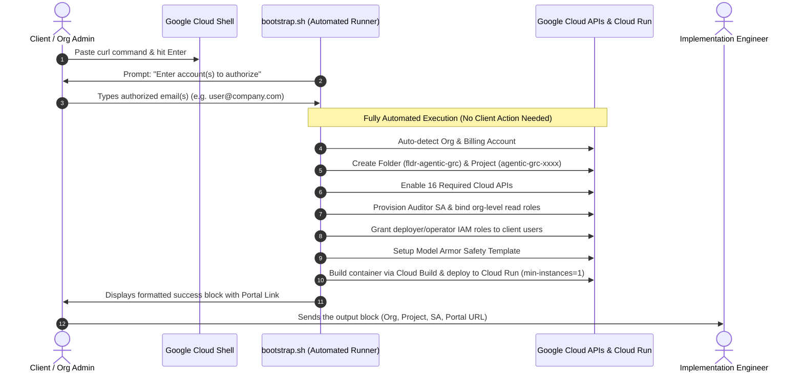

# Product Implementation & Deployment Guide: Agentic GRC Auditor
## Fully Automated Google Cloud Platform (GCP) Provisioning & Deployment

> **Target Platform**: Google Cloud Platform (Cloud Shell, Cloud Run, Vertex AI, Cloud Asset Inventory)  
> **Deployment Mode**: 100% Cloud-Native (Zero local machine installation required)  
> **Target Region**: `us-central1`  
> **Service Name**: `mcp-server-grc`  
> **Language**: English

---

## 1. Executive Summary & Client Experience

The deployment of the **Agentic GRC Auditor** platform is entirely automated and transparent. The client does not need to install tools, configure environments, or run multi-stage command sequences on their laptop.

### The Single Client Workflow:
1. **Open Google Cloud Shell**.
2. **Paste the single curl command** and press Enter.
3. **Type the email address(es)** of team members who should receive access.
4. **Copy the final output block** (containing Organization, Project, and Portal URL) and send it to the implementation engineer.



---

## 2. Automated One-Click Deployment Command

In [Google Cloud Shell](https://shell.cloud.google.com), execute the single bootstrap command:

```bash
curl -sSL https://raw.githubusercontent.com/g-jsaccomani/agentic_grc_certifications/main/terraform/first_steps/bootstrap.sh | bash
```

### Prompt Interaction (The Only Step for the Client):
During execution, the script will prompt for the team email(s):
```text
[4/6] Configuring Authorized Platform Access...
Please specify the email address(es) of the user(s) or group(s) who will have access.
Supported: engineer@company.com or comma-separated: user1@company.com, user2@company.com

Enter account(s) to authorize [Default: current-user@company.com]: 
```
Type the email(s) and press **Enter** (or simply press Enter to accept your current logged-in Google Cloud account).

---

## 3. What the Automated Script Executes End-to-End

Everything below executes automatically without manual intervention:

1. **Tool Verification**: Checks for a functional Terraform or OpenTofu binary. If missing or running inside a Cloud Shell placeholder, it automatically installs official HashiCorp Terraform into `~/.local/bin`.
2. **Organization & Billing Detection**: Automatically discovers your GCP Organization ID and active billing account.
3. **Dedicated Folder & Project**: Provisions the `fldr-agentic-grc` folder and an isolated host project (`agentic-grc-<id>`) with billing attached.
4. **Enables 16 Google Cloud APIs**:
   - `run.googleapis.com` (Cloud Run serverless runtime)
   - `aiplatform.googleapis.com` (Vertex AI and Gemini 2.5)
   - `modelarmor.googleapis.com` (Prompt-injection defense)
   - `cloudasset.googleapis.com` (Organization-level asset inspection)
   - `securitycenter.googleapis.com` (Security Command Center integration)
   - `cloudkms.googleapis.com` (Cryptographic key validation)
   - `bigquery.googleapis.com` (Audit logging and analytics)
   - `accesscontextmanager.googleapis.com` (VPC-SC perimeter validation)
   - `cloudbuild.googleapis.com` & `artifactregistry.googleapis.com` (Container builds)
   - Management: `iam.googleapis.com`, `cloudresourcemanager.googleapis.com`, `serviceusage.googleapis.com`, `logging.googleapis.com`, `monitoring.googleapis.com`
5. **Auditor Identity Provisioning**: Creates the auditor service account (`sa-agentic-grc-auditor@<PROJECT_ID>.iam.gserviceaccount.com`) and binds read-only organization-level roles (`roles/cloudasset.viewer`, `roles/browser`, `roles/iam.securityReviewer`, `roles/securitycenter.findingsViewer`).
6. **User Access Binding**: Grants authorized users administrative and operator roles on the project (`roles/run.admin`, `roles/iam.serviceAccountUser`, `roles/resourcemanager.projectIamAdmin`, `roles/serviceusage.serviceUsageAdmin`).
7. **Model Armor Safety Template**: Configures the `g-rc-safety-baseline` template with prompt-injection defense.
8. **Cloud Run Application Deployment**: Builds the production container using Cloud Build and launches the service `mcp-server-grc` on Cloud Run in `us-central1` with `--min-instances=1`, 2 vCPU, and 2 GiB RAM.

---

## 4. Expected Output to Send to the Engineer

When the deployment finishes, the terminal displays the final success block:

```text
================================================================
        AGENTIC GRC: DEPLOYMENT COMPLETED SUCCESSFULLY!         
================================================================

Please copy the entire block below and send it to your engineer:

----------------------------------------------------------------
GCP_ORGANIZATION:  31564119954
GCP_PROJECT_ID:    agentic-grc-cd06
GCP_FOLDER_ID:     folders/123456789012
AUDITOR_SA:        sa-agentic-grc-auditor@agentic-grc-cd06.iam.gserviceaccount.com
AUTHORIZED_USERS:  engineer@company.com
PORTAL_ACCESS_URL: https://mcp-server-grc-938078169010.us-central1.run.app/portal
----------------------------------------------------------------

Everything is live and running. No further actions required on your end.
```

The client simply copies this block and delivers it to the implementation engineer.

---

## 5. Real-Time Error Diagnostic Handling ("Hotfix Resolution")

To ensure rapid resolution if an unexpected permission or quota issue occurs, the script contains an integrated error diagnostic trap. 

If any command fails at any stage, the script halts cleanly and outputs an **Error Diagnostic Block**:

```text
================================================================
                 DEPLOYMENT ENCOUNTERED AN ERROR                
================================================================

Please copy the entire error diagnostic block below and send it
to the implementation engineer for immediate hotfix resolution:

----------------------------------------------------------------
TIMESTAMP:        2026-09-08T17:45:12Z
FAILED AT STEP:   Provisioning Folder, Project, APIs, and IAM Roles
EXIT CODE:        1
GCP ACCOUNT:      admin@client.corp
ORGANIZATION ID:  31564119954
PROJECT ID:       agentic-grc-cd06
LOG FILE PATH:    /tmp/agentic_grc_bootstrap_20260908_174022.log
----------------------------------------------------------------

ERROR DIAGNOSTIC TRACE (LAST 30 LOG ENTRIES):
... detailed API or Terraform error message ...
----------------------------------------------------------------
```

The client copies this block and sends it to the engineer, who can immediately identify the root cause (e.g., missing billing permission or organization policy constraint) and provide an instant hotfix.

---

## 6. Post-Deployment Optional Adjustments (Engineer Reference)

These optional configurations can be performed by the implementation engineer using the information provided in the client's output block.

### 6.1 Google Workspace OAuth 2.0 Single Sign-On (SSO)
To enable corporate Google Workspace domain login:
1. In the Google Cloud Console, navigate to **APIs & Services** > **Credentials** in the provisioned project.
2. Create an **OAuth 2.0 Client ID** (Web application).
3. Set **Authorized JavaScript Origins** to `https://<service-url>`.
4. Set **Authorized Redirect URIs** to `https://<service-url>/portal`.
5. Update `GOOGLE_WORKSPACE_CONFIG` in `mcp_server_grc/portal_html.py` with the Client ID and domain.
6. Run `bash scripts/deploy.sh` to refresh the Cloud Run revision.

### 6.2 Temporary Consultant / Partner Access (Time-Boxed IAM)
If external auditors or consultants require temporary access to assist with verification:

```bash
PROJECT_ID="<GCP_PROJECT_ID>"
CONSULTANT_EMAIL="user:consultant@partner.corp"
EXPIRY="$(date -u -v+7d "+%Y-%m-%dT%H:%M:%SZ" 2>/dev/null || date -u -d "+7 days" "+%Y-%m-%dT%H:%M:%SZ")"

for ROLE in "roles/run.admin" "roles/iam.serviceAccountUser" "roles/resourcemanager.projectIamAdmin"; do
  gcloud projects add-iam-policy-binding "${PROJECT_ID}" \
    --member="${CONSULTANT_EMAIL}" \
    --role="${ROLE}" \
    --condition="expression=request.time < timestamp('${EXPIRY}'),title=temp_access,description=Expires at ${EXPIRY}" \
    --quiet
done
```

Revoke access at any time:
```bash
for ROLE in "roles/run.admin" "roles/iam.serviceAccountUser" "roles/resourcemanager.projectIamAdmin"; do
  gcloud projects remove-iam-policy-binding "${PROJECT_ID}" \
    --member="${CONSULTANT_EMAIL}" \
    --role="${ROLE}" \
    --all \
    --quiet
done
```

---

## 7. Cloud Operational Commands

| Objective | Command |
| :--- | :--- |
| **Check Cloud Run Service** | `gcloud run services describe mcp-server-grc --project="${PROJECT_ID}" --region="us-central1"` |
| **Keep Instance Warmed** | `gcloud run services update mcp-server-grc --project="${PROJECT_ID}" --region="us-central1" --min-instances=1` |
| **Tail Application Logs** | `gcloud run services logs tail mcp-server-grc --project="${PROJECT_ID}" --region="us-central1"` |
| **Trigger Redeployment** | `bash scripts/deploy.sh` |
