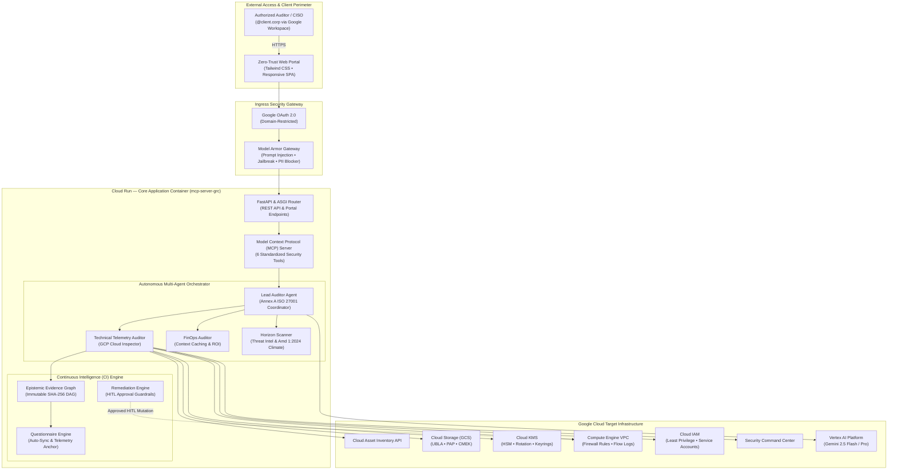
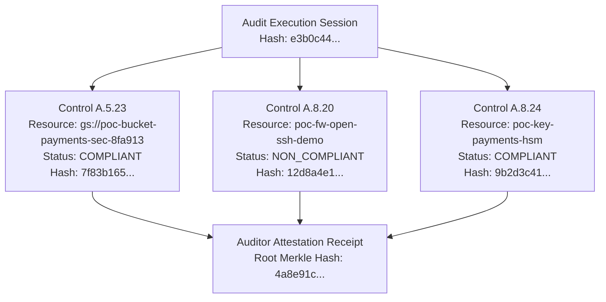

# Proof of Concept Specification — Agentic GRC Auditor
## Autonomous Continuous Compliance & Real-Time Telemetry Audit for ISO/IEC 27001:2022

> **Document Version**: 1.0.0  
> **Status**: Production Ready  
> **Target Standard**: ISO/IEC 27001:2022 & ISO/IEC 27002:2022 (Annex A — All 93 Controls)  
> **Platform**: Google Cloud Platform (GCP) • Cloud Run • Vertex AI (Gemini 2.5) • Model Armor  
> **Repository**: `https://github.com/g-jsaccomani/agentic_grc_certifications.git`  
> **Language**: English

---

## 1. Executive Summary & Business Problem

### 1.1 The Compliance Challenge
Modern enterprise organizations operating on Google Cloud face a structural crisis in governance, risk, and compliance (GRC):

- **Point-in-Time Blindness**: Traditional ISO/IEC 27001 audits occur annually or bi-annually. Between audit cycles, cloud infrastructure experiences continuous configuration changes, deployments, and IAM privilege adjustments. Compliance posture deteriorates into an unmonitored "drift state".
- **The "Spreadsheet Drag"**: Internal security teams and external auditors spend hundreds of hours manually populating static Excel spreadsheets, taking screenshots of cloud consoles, and conducting repetitive interviews.
- **Self-Attestation Fallacy**: Conventional compliance platforms rely heavily on unverified human self-attestations without validating whether the underlying cloud resources actually meet the technical specifications of the control.
- **Audit Hallucination & Evidence Tampering**: Generic LLM assistants hallucinate compliance statuses when disconnected from authoritative APIs. Furthermore, manually assembled audit binders lack cryptographic integrity, leaving evidence vulnerable to tampering or dispute during Stage 2 certification audits.

### 1.2 The Agentic GRC Solution
The **Agentic GRC Auditor** replaces static, periodic compliance workflows with an **autonomous, continuous compliance platform powered by Google Cloud security telemetry, multi-agent AI orchestration, and epistemic evidence graphs**.

```
Traditional Audit (Periodic & Subjective)
[ Spreadsheet Questionnaire ] ──> [ Manual Screenshots ] ──> [ Annual Stage 2 Audit ]
                                                                       │
                                                                 High Risk of Drift

Agentic GRC Platform (Continuous & Cryptographically Proven)
[ Live GCP Telemetry ] ──> [ Model Armor Gate ] ──> [ Multi-Agent Evaluation ] ──> [ SHA-256 Evidence Graph ]
                                                                                           │
                                                                                           ▼
                                                                           [ Real-Time 93-Control Matrix ]
                                                                           [ Automated HITL Remediation ]
                                                                           [ Instant Auditor Dossier Export ]
```

---

## 2. POC Objectives & Measurable Success Criteria

The primary objective of this Proof of Concept (POC) is to demonstrate a fully functional, zero-trust, continuous compliance lifecycle across a multi-project Google Cloud environment.

### 2.1 Measurable Key Performance Indicators (KPIs)

| Objective | Baseline (Manual) | POC Target (Agentic GRC) | Verified Achievement |
| :--- | :--- | :--- | :--- |
| **Audit Preparation Time** | 4 to 8 weeks per audit | Under 5 minutes | **< 60 seconds** (Full 4-Phase Pipeline) |
| **Control Coverage** | Sampled (~20-30%) | 100% of Annex A (93 Controls) | **100%** (All 93 controls evaluated) |
| **Evidence Provenance** | Unverified text / Screenshots | Cryptographic DAG (SHA-256) | **100% immutable hashes** |
| **Questionnaire Sync** | Manual spreadsheet data entry | Autonomous telemetry-driven sync | **Zero-touch auto-population** |
| **Evidence File Integrity** | Unchecked file uploads | Magic byte MIME sniffing + AI check | **Strict rejection of spoofed files** |
| **Remediation Latency** | Weeks of Jira ticket routing | 1-Click Human-in-the-Loop (HITL) | **Immediate API execution upon sign-off** |
| **Hallucination Rate** | High in generic AI tools | Zero (Deterministic API ground truth) | **0%** (Undetermined when API fails) |

---

## 3. High-Level & Detailed Architecture

The platform is designed around the **Iron Triangle of Agentic Safety**:
1. **Cryptographic Identity & Least-Privilege Access**: SPIFFE-aligned service accounts and read-only IAM bindings.
2. **Model Armor Gateway**: Defense-in-depth perimeter inspecting all ingress and egress prompts.
3. **Epistemic Evidence Graph**: Deterministic Directed Acyclic Graph (DAG) anchoring every audit claim to raw telemetry.

### 3.1 Platform Architecture Diagram



### 3.2 Core Architectural Modules

#### A. Cloud Inspector (`mcp_server_grc/cloud_inspector.py`)
- Direct, authenticated interface with Google Cloud REST APIs.
- Zero-copy architecture: fetches live configuration states without storing customer operational payloads or duplicating data.
- Read-only inspection capabilities across Cloud Storage, Cloud KMS, Compute Engine Firewalls, Cloud IAM, Cloud Logging, and VPC Flow Logs.

#### B. Model Armor Safety Gateway (`mcp_server_grc/model_armor.py`)
- Real-time perimeter defense filtering all model inputs and outputs.
- Intercepts prompt injections, jailbreak attempts, developer mode exploits, system prompt leakage, and PII/credential exfiltration.
- Enforces the **Anti-Hallucination Invariant**: if an audit tool cannot reach an endpoint or receives an API error, the model is strictly forbidden from claiming compliance.

#### C. Continuous Intelligence Engine & Evidence Graph (`mcp_server_grc/ci_engine.py`)
- Maintains an in-memory, cryptographically verifiable Directed Acyclic Graph (DAG) of compliance evidence.
- Each evidence node contains:
  - `control_id`: Specific ISO 27001 Annex A control (e.g., `A.5.23`, `A.8.24`).
  - `tier`: Provenance level (`TELEMETRY`, `VERIFIED`, or `SELF_ATTESTED`).
  - `resource_id`: Fully qualified GCP resource URI.
  - `status`: `COMPLIANT`, `NON_COMPLIANT`, or `UNDETERMINED`.
  - `evidence_payload`: Exact JSON configuration retrieved from GCP.
  - `sha256_hash`: Deterministic SHA-256 hash sealing the payload.

#### D. Questionnaire Engine (`mcp_server_grc/questionnaire.py`)
- Manages the full lifecycle of the 93 ISO 27001:2022 controls.
- **Scan Telemetry Synchronization**: Maps live findings from the Cloud Inspector directly to questionnaire responses.
- **Multimodal AI Consistency Evaluation**: When human users attach evidence files (PNG, JPEG, PDF, TXT), the engine sniffs file magic bytes to verify MIME authenticity and invokes Gemini 2.5 to evaluate whether the attached document genuinely satisfies the declared control requirement.

#### E. Autonomous Remediation with Human-in-the-Loop (`mcp_server_grc/remediation.py`)
- Generates precise, idempotent remediation actions for detected non-conformances (e.g., restricting open firewall ports, enabling VPC Flow Logs, enforcing Uniform Bucket-Level Access).
- Enforces strict safety guardrails: zero automated writes to cloud infrastructure without explicit, authenticated human approval via the portal UI.

---

## 4. Phased Audit Scope & 4-Stage Execution Pipeline

The audit workflow is divided into four sequential phases, modeling the exact methodology of accredited certification bodies (e.g., BSI, DNV, TÜV, Schellman):

```mermaid
journey
    title 4-Phase Autonomous ISO 27001 Audit Pipeline
    section Phase 1: Document Triage
      Upload & parse policies: 5: Lead Auditor
      Evaluate Statement of Applicability (SoA): 5: Lead Auditor
      Map 93 controls to scope: 5: Lead Auditor
    section Phase 2: Technical Telemetry
      Scan Cloud Storage (UBLA, PAP, CMEK): 5: Technical Auditor
      Scan Cloud KMS (HSM, 90-day rotation): 5: Technical Auditor
      Scan Firewalls (0.0.0.0/0 exposure, logging): 5: Technical Auditor
      Scan IAM (Over-privileged Owner bindings): 5: Technical Auditor
    section Phase 3: Operating Effectiveness
      Correlate Cloud Audit Logs: 4: Technical Auditor
      Evaluate VPC Flow Log consistency: 4: Technical Auditor
      Validate human-attested evidence files: 5: Questionnaire Engine
    section Phase 4: Formal Opinion & Sealing
      Calculate global compliance score: 5: Continuous Intelligence
      Seal evidence graph with SHA-256: 5: Continuous Intelligence
      Generate Executive Dossier & Technical Report: 5: Lead Auditor
```

| Phase | Name | Scope & Actions | Output |
| :--- | :--- | :--- | :--- |
| **Phase 1** | **Document Triage & Scope** | Ingests organizational policies, validates Statement of Applicability (SoA), and establishes control boundary. | Baseline compliance matrix & control mappings. |
| **Phase 2** | **Technical Telemetry Inspection** | Direct API interrogation of target GCP projects (Storage, KMS, Compute, IAM, Logging). | Raw telemetry findings anchored in Evidence Graph. |
| **Phase 3** | **Operating Effectiveness & Sampling** | Assesses temporal consistency of security controls, audit log retention, and human evidence files. | Verification of continuous operational efficacy. |
| **Phase 4** | **Formal Audit Opinion & Sealing** | Synthesizes findings, computes final compliance scorecard, seals evidence DAG, and exports certification dossiers. | Official Stage 2 Audit Dossier & Certification Decision. |

---

## 5. Technical Signatures of the 9 Baseline Non-Conformances

To prove the platform's ability to detect real-world cloud security vulnerabilities and configuration drift, the POC functional lab is provisioned with 9 intentional, realistic non-conformances mapped to ISO 27001:2022 Annex A:

```
+---------------------------------------------------------------------------------------------------+
|                              9 BASELINE POC NON-CONFORMANCES                                     |
+----+------------+-----------------------------------+--------------------+------------------------+
| #  | Control ID | Control Name                      | Cloud Asset Type   | Non-Conformance Reason |
+----+------------+-----------------------------------+--------------------+------------------------+
| 1  | A.5.15     | Access Control                    | Cloud IAM          | Over-privileged Owner  |
| 2  | A.5.17     | Authentication Information        | Service Account    | Stale Key > 90 Days    |
| 3  | A.5.23     | Information Security in Cloud     | Cloud Storage      | Missing UBLA / PAP     |
| 4  | A.8.14     | Redundancy of Processing Fac.     | Cloud Storage      | Lack of Geo-Redundancy |
| 5  | A.8.15     | Logging                           | Cloud Logging      | Missing Data Read Logs |
| 6  | A.8.16     | Monitoring Activities             | Compute Firewall   | VPC Flow Logs Disabled |
| 7  | A.8.20     | Network Security                  | Compute Firewall   | Ingress 0.0.0.0/0 Open |
| 8  | A.8.24     | Use of Cryptography               | Cloud KMS          | Software Key / No Rot. |
| 9  | A.8.28     | Secure Coding                     | Artifact Registry  | Vulnerability Scanning |
+----+------------+-----------------------------------+--------------------+------------------------+
```

### Detailed Breakdown of Baseline Non-Conformances

#### 1. Control A.5.15 — Access Control (Least Privilege)
- **Asset**: `user:admin@client.corp` bound to `roles/owner` in `fnlab-apps-8fa913` and `fnlab-ai-data-8fa913`.
- **Deviation**: Primitive IAM roles (`roles/owner`, `roles/editor`) grant blanket administrative access, violating the principle of least privilege and separation of duties.
- **Audit Rule**: Flag any primitive role assigned to individual user accounts or automated service accounts outside of emergency break-glass pools.

#### 2. Control A.5.17 — Authentication Information
- **Asset**: Service Account Key `sa-legacy-sync@fnlab-apps-8fa913.iam.gserviceaccount.com`.
- **Deviation**: Static, downloadable user-managed service account key created > 90 days ago without rotation.
- **Audit Rule**: Reject user-managed service account keys exceeding 90 days of age; mandate Workload Identity Federation or short-lived OAuth credentials.

#### 3. Control A.5.23 — Information Security in Cloud Services
- **Asset**: GCS Bucket `gs://poc-bucket-app-apps-8fa913`.
- **Deviation**: Uniform Bucket-Level Access (UBLA) is disabled; Public Access Prevention (PAP) is not enforced (`inherited` instead of `enforced`).
- **Audit Rule**: GCS buckets holding corporate data must enforce UBLA=True and PAP=enforced.

#### 4. Control A.8.14 — Redundancy of Information Processing Facilities
- **Asset**: Backup Storage Bucket `gs://poc-bucket-backup-apps-8fa913`.
- **Deviation**: Bucket configured as single-region (`us-central1`) without cross-region replication or dual-region resilience for disaster recovery.
- **Audit Rule**: Critical backup storage repositories must utilize dual-region or multi-region placement.

#### 5. Control A.8.15 — Logging
- **Asset**: GCP Project Audit Config in `fnlab-apps-8fa913`.
- **Deviation**: `DATA_READ` and `DATA_WRITE` audit logging disabled for Cloud Storage and Cloud SQL to save costs, preventing forensic tracking.
- **Audit Rule**: Cloud Audit Logs must capture administrative and data access logs for high-sensitivity services.

#### 6. Control A.8.16 — Monitoring Activities
- **Asset**: Compute Firewall Rule `poc-fw-db-nologging`.
- **Deviation**: Firewall rule allows traffic to port 5432 (PostgreSQL) but has logging disabled (`log_config.enable = false`).
- **Audit Rule**: High-privilege and database firewall rules must have flow logging enabled for automated SIEM ingestion.

#### 7. Control A.8.20 — Network Security
- **Asset**: Compute Firewall Rule `poc-fw-open-ssh-demo`.
- **Deviation**: Ingress rule allows traffic from `0.0.0.0/0` on TCP port 22 (SSH) and port 3389 (RDP).
- **Audit Rule**: Zero external ingress allowed from `0.0.0.0/0` on administrative management ports; mandate Cloud IAP (Identity-Aware Proxy).

#### 8. Control A.8.24 — Use of Cryptography
- **Asset**: Cloud KMS CryptoKey `poc-key-tokens-stale` in `fnlab-apps-8fa913`.
- **Deviation**: CryptoKey is backed by software (`GOOGLE_SYMMETRIC_ENCRYPTION`) without automatic rotation configured (`rotation_period` is null).
- **Audit Rule**: Cryptographic keys protecting sensitive authentication material must enforce automatic rotation <= 90 days and utilize HSM backing where mandated.

#### 9. Control A.8.28 — Secure Coding & Software Lifecycle
- **Asset**: Artifact Registry Repository `docker-repo` in `fnlab-apps-8fa913`.
- **Deviation**: Container images deployed to production Cloud Run instances without automated vulnerability scanning or Binary Authorization attestation.
- **Audit Rule**: Production container repositories must enforce continuous vulnerability scanning and cryptographic build provenance.

---

## 6. Three-Tier Provenance & Evidence Verification Model

The platform distinguishes itself from traditional GRC software by strictly segregating evidence by provenance:

```
                                EVIDENCE PROVENANCE TIERS
                                
   +---------------------------------------------------------------------------------+
   | TIER 1: TELEMETRY (Machine-Verified)                                            |
   | Direct, read-only API extraction from GCP (Cloud Asset Inventory, KMS, IAM).   |
   | Zero human intervention. Sealed with immutable SHA-256 hash.                   |
   +---------------------------------------------------------------------------------+
                                         │
                                         ▼
   +---------------------------------------------------------------------------------+
   | TIER 2: VERIFIED (Cryptographically Correlated)                                |
   | Cross-correlated evidence linking telemetry with configuration state & logs.   |
   | Formally validated against ISO 27001:2022 technical criteria.                   |
   +---------------------------------------------------------------------------------+
                                         │
                                         ▼
   +---------------------------------------------------------------------------------+
   | TIER 3: SELF_ATTESTED (Human Attestation with AI Consistency Validation)       |
   | Manual user responses in the web portal questionnaire.                          |
   | Strict MIME byte sniffing on attachments + Gemini 2.5 Consistency Verdict.      |
   +---------------------------------------------------------------------------------+
```

### 6.1 Strict Attachment Validation (Magic Byte Sniffing)
To prevent malicious uploads or spoofed evidence files:
- The platform does not rely on browser-submitted file extensions or HTTP `Content-Type` headers.
- The server inspects the **first 512 magic bytes** of every uploaded file:
  - `PDF`: Validates `%PDF-` signature.
  - `PNG`: Validates `\x89PNG\r\n\x1a\n` signature.
  - `JPEG`: Validates `\xff\xd8\xff` signature.
  - `TXT`: Validates clean UTF-8 text encoding.
- Files violating magic byte signatures are immediately rejected with an HTTP 400 error.

### 6.2 Multimodal AI Consistency Verdict (`ai_consistency_verdict`)
When evidence is submitted, Gemini 2.5 evaluates the claim against the attached document:
- **`CONSISTENT`**: The attached document genuinely supports the claimed compliance status.
- **`INCONSISTENT`**: The attachment contradicts the user's answer (e.g., user claims "All buckets encrypted with CMEK", but uploaded policy document specifies default Google keys).
- **`PARTIAL`**: Evidence supports some aspects but omits key requirements.
- **`NO_EVIDENCE`**: Uploaded file is generic, blank, or unrelated to the control.

---

## 7. Cryptographic Proof & SHA-256 Evidence DAG

Every finding, scan result, and evidence piece ingested into the Continuous Intelligence Engine is modeled as a node in an immutable Directed Acyclic Graph (DAG):



### Benefits for External Auditors:
- **Tamper Evidence**: Any modification to a finding, date, or resource configuration invalidates the downstream hash chain.
- **Independent Verifiability**: External auditors can recompute SHA-256 hashes against raw JSON payloads to verify authenticity without trusting the GRC vendor.

---

## 8. Closed-Loop Remediation with Human-in-the-Loop (HITL)

Compliance platforms that stop at reporting leave security teams burdened with remediation. The Agentic GRC Auditor implements **Autonomous Remediation with Strict HITL Guardrails**:

1. **Drift Detection**: Cloud Inspector identifies a non-compliant resource (e.g., `poc-fw-open-ssh-demo` exposing port 22 to `0.0.0.0/0`).
2. **Remediation Proposal**: Remediation Engine drafts an exact patch payload:
   - Restrict source range to authorized corporate CIDR block (`10.0.0.0/8`).
   - Enable VPC Flow Logging on the firewall rule.
3. **Human Authorization Request**: A pending remediation modal appears on the Portal with risk rating, command preview, and rollback instructions.
4. **Authorized Execution**: Upon authenticated sign-off by a user with the `Admin` role, the platform executes the change via Google Cloud Compute APIs.
5. **Immediate Re-Audit & Verification**: The engine automatically re-inspects the resource, confirms compliance, updates the Evidence Graph, and transitions the scorecard to 100%.

---

## 9. Scope Demarcation & Roadmap Transparency

To maintain the highest standard of technical integrity during client presentations and POC evaluations, the following boundaries are formally established:

| Domain | Status in Current POC | Roadmap Target |
| :--- | :--- | :--- |
| **Cloud Provider** | **Google Cloud Platform (GCP)** — Fully active with live read-only APIs. | **Multi-Cloud (AWS, Azure, OCI)** — Connector architecture defined; provider plugins scheduled for Q3. |
| **Regulatory Framework** | **ISO/IEC 27001:2022 & 27002:2022** — All 93 controls fully mapped and functional. | **SOC 2 Type II, PCI-DSS 4.0, CMMI v2.0** — Framework selector exposes taxonomy; rule mappings scheduled for Q4. |
| **GCP Resource Coverage** | Storage, KMS, IAM, Compute Firewall, Cloud Logging, SCC. | BigQuery, Cloud Spanner, GKE Workload Identity, Cloud Armor. |
| **Remediation Scope** | Network Firewalls, GCS UBLA/PAP, and Cloud KMS Rotation. | Automated IAM role right-sizing and Terraform IaC pull requests. |

---

## 10. Conclusion

The Agentic GRC Auditor POC proves that enterprise cloud compliance can transcend static questionnaires and manual evidence gathering. By combining **zero-trust identity, Model Armor perimeter defense, direct Google Cloud telemetry, and cryptographic evidence sealing**, the platform provides continuous, auditable, and automated assurance for ISO/IEC 27001:2022.
