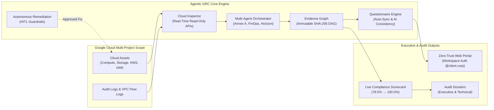

# Proof of Concept (POC) — Agentic GRC Auditor
## Google Cloud Security & Autonomous Continuous Compliance for ISO/IEC 27001:2022

> **Document Status**: Production Ready  
> **Target Framework**: ISO/IEC 27001:2022 & ISO/IEC 27002:2022 (Annex A — All 93 Controls)  
> **Platform**: Google Cloud Platform (GCP) • Cloud Run • Vertex AI (Gemini 2.5) • Model Armor  
> **Repository**: `https://github.com/g-jsaccomani/agentic_grc_certifications.git`  
> **Language**: English (Standard Documentation)

---

## 1. Executive Summary

This directory contains the complete, authoritative documentation package for the **Agentic GRC Auditor Proof of Concept (POC)**. 

The platform transforms cloud compliance from manual, periodic, spreadsheet-driven questionnaires into **autonomous, real-time, continuous compliance intelligence grounded in verifiable Google Cloud telemetry and cryptographic evidence chains**.

---

## 2. POC Documentation Structure

The documentation is organized into dedicated, comprehensive guides:

| Document | Description | Target Audience |
| :--- | :--- | :--- |
| **[`POC_DOCUMENT.md`](./POC_DOCUMENT.md)** | **Complete POC Specification**: Business problem, objectives, success criteria, technical architecture, phased audit scope, the 9 baseline non-conformances, and safety guardrails. | CISO, Lead Auditors, Enterprise Architects, Security Leadership |
| **[`HOW_TO.md`](./HOW_TO.md)** | **Product Implementation & GCP Deployment Guide**: Automated one-line Cloud Shell bootstrap (`curl ... \| bash`), resource provisioning (Folder, Project, 16 APIs, IAM, Service Account), user access setup, and Cloud Run deployment. | DevOps Engineers, Cloud Platform Admins, Security Architects |
| **[`ENVIRONMENT_SETUP.md`](./ENVIRONMENT_SETUP.md)** | **Infrastructure & Deployment Guide**: Step-by-step GCP project provisioning, IAM permissions, Cloud Run deployment, Google Workspace OAuth 2.0 configuration, and local setup. | DevOps Engineers, Cloud Platform Admins, Security Engineers |
| **[`TESTING_AND_VERIFICATION.md`](./TESTING_AND_VERIFICATION.md)** | **Quality Assurance & Verification**: Full test suite overview (184 automated tests), automated verification scripts (`verify_poc_environment.py`), API verification commands (`curl`), and teardown procedures. | QA Engineers, Internal Auditors, Technical Reviewers |
| **[`scripts/`](./scripts/)** | **POC Automation & Verification Scripts**: Standalone audit scripts (`verify_poc_environment.py`, `poc_live_audit.py`, `cleanup_poc_resources.sh`, `smoke_test.py`). | Engineers, Presenters, Auditors |

---

## 3. Key POC Value Propositions

1. **Deterministic Telemetry vs. Hallucination**:
   - The platform never fabricates or assumes compliance.
   - If a resource cannot be read due to missing permissions or absence, the system explicitly reports `UNDETERMINED` or `NOT_FOUND` alongside baseline ISO requirements.
2. **Three-Tier Provenance Separation**:
   - **`TELEMETRY`**: Automated machine-verified checks directly from Google Cloud APIs.
   - **`VERIFIED`**: Validated through cryptographic evidence linking.
   - **`SELF_ATTESTED`**: Human questionnaire answers with strict demarcation and AI consistency scoring via Gemini 2.5.
3. **Automatic Questionnaire Synchronization**:
   - Running a phased scan automatically populates the 93 ISO controls with verified evidence and non-conformance findings.
   - Zero spreadsheet drag or redundant manual data entry.
4. **Immutable Cryptographic Proof**:
   - Every evidence node is sealed with a deterministic SHA-256 hash.
   - Produces tamper-evident audit receipts suitable for external certification auditors (e.g., BSI, Bureau Veritas, DNV).
5. **Closed-Loop Remediation with Human-in-the-Loop (HITL)**:
   - Automated remediation proposals for detected drifts (IAM over-privileging, firewall exposure, missing CMEK, lack of VPC Flow Logs).
   - Requires explicit authorized human sign-off before executing infrastructure adjustments.

---

## 4. Quick Links & Repository Assets

- **Live Cloud Run Deployment**: `https://mcp-server-grc-938078169010.us-central1.run.app`
- **Web Portal Route**: `https://mcp-server-grc-938078169010.us-central1.run.app/portal`
- **Terraform Bootstrap Module**: [`terraform/first_steps/`](../terraform/first_steps/)
- **Live Verification Scripts**: [`scripts/`](../scripts/)
  - [`scripts/poc_live_audit.py`](../scripts/poc_live_audit.py)
  - [`scripts/verify_poc_environment.py`](../scripts/verify_poc_environment.py)
  - [`scripts/cleanup_poc_resources.sh`](../scripts/cleanup_poc_resources.sh)
- **Unit & Integration Tests**: [`tests/`](../tests/) (184 passed tests)
